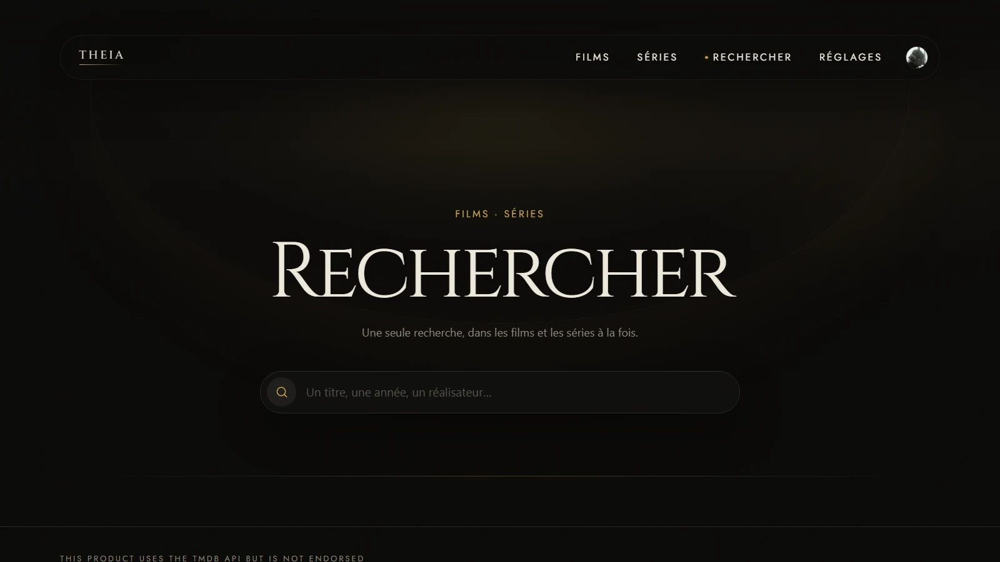
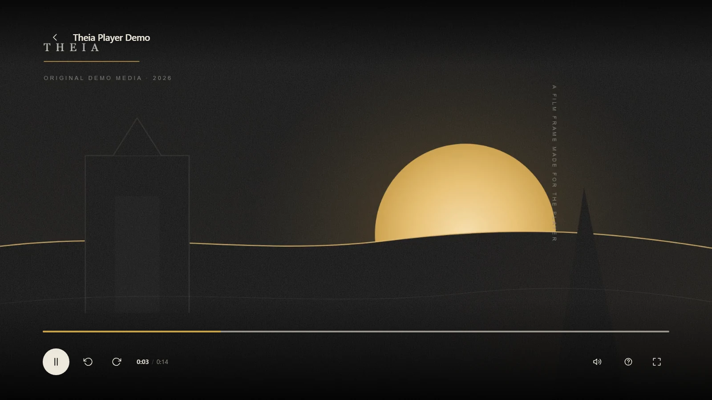

<p align="center">
  
</p>

<h1 align="center">Theia</h1>

<p align="center">
  <strong>Your films and series. One binary. Your network.</strong>
</p>

<p align="center">
  <a href="https://github.com/Benitoow/theia-media/releases/latest"></a>
  <a href="https://github.com/Benitoow/theia-media/actions/workflows/ci.yml"></a>
  <a href="LICENSE"></a>
  
</p>

<p align="center">
  <a href="https://benitoow.github.io/theia-media/">Website</a> ·
  <a href="https://github.com/Benitoow/theia-media/releases/latest">Download</a> ·
  <a href="#three-minute-setup">Setup</a> ·
  <a href="#theia-plex-jellyfin-or-emby">Compare</a>
</p>


Theia turns folders of films and series into a private cinema for the browsers
already on your television, phone and computer. Run one native executable, add
your folders and watch. There is no Theia account, subscription, Docker stack,
external database or separate web app to install.

| One file | Built for choosing | Private by default |
| --- | --- | --- |
| The Go server, SQLite database driver and Svelte interface ship in one binary. FFmpeg is downloaded only when a file needs conversion. | Resume, profiles, watchlists, duration filters, one search across films and series, and a nightly pick. | No telemetry or cloud library. Metadata comes from TMDB; updates come from GitHub Releases. |

## See V3.1

| Search the whole library | Open a film |
| --- | --- |
|  |  |



These are captures from the running V3.1 build, not mock-ups. Film artwork and
metadata come from TMDB. The player image uses the repository's original
[demonstration frame](docs/screenshots/source-player-demo-media.svg), so no film
frame was copied into the project.

## What you get

- **A library that stays current.** Theia scans several folders, watches for new
  files, groups alternate versions under one title and keeps files where they
  already live.
- **Films and series with useful records.** Titles, posters, backdrops, cast,
  crew, runtime, certification, seasons and episodes are cached locally from
  TMDB. A wrong match can be replaced from the film or series page.
- **A cinema that remembers people.** Local profiles keep separate progress,
  watched state and watchlists. Profiles are household identities, not accounts;
  they have no passwords.
- **A player that adapts.** Theia direct-plays compatible media, remuxes when it
  can and transcodes when it must. Audio, text subtitles, quality, resume,
  seeking and preview frames stay in the player.
- **Access outside the house without a Theia cloud.** The built-in remote mode
  uses device-keyed WireGuard and exposes viewer capabilities only. There is no
  relay, rendezvous server or control plane.
- **Updates with a way back.** Theia verifies release digests, waits for playback
  to stop, swaps the executable atomically and keeps the previous version for
  rollback.

Theia deliberately has no live TV, DVR, music library, plugins, native client
apps or multi-user permissions. If those matter, the comparison below saves you
an installation you would later resent.

## Three-minute setup

1. Download the binary for your operating system and CPU from
   [GitHub Releases](https://github.com/Benitoow/theia-media/releases/latest).
2. Run it and keep the terminal open. Theia prints `http://localhost:8383` and
   the LAN address for your other screens.
3. Open **Settings**, add one or more media folders, then start the scan.

| Platform | First run |
| --- | --- |
| Windows x64 | `theia-windows-amd64.exe` |
| Windows on ARM | `theia-windows-arm64.exe` |
| macOS Apple silicon | `chmod +x theia-darwin-arm64 && ./theia-darwin-arm64` |
| macOS Intel | `chmod +x theia-darwin-amd64 && ./theia-darwin-amd64` |
| Linux x64 | `chmod +x theia-linux-amd64 && ./theia-linux-amd64` |
| Linux ARM64 | `chmod +x theia-linux-arm64 && ./theia-linux-arm64` |

Release binaries are unsigned and run in the foreground. Windows may show a
reputation warning; macOS may require **Privacy & Security → Open Anyway** after
the first launch attempt.

> [!WARNING]
> The LAN service has no login. Anyone who can reach TCP `8383` can browse,
> stream and administer Theia. Keep it on a trusted network and **never forward
> port 8383 to the internet**. Use Theia's remote-access screen instead. The
> [security policy](.github/SECURITY.md) explains the boundary.

## Hardware guide

The expensive part is video conversion. Direct play mostly reads a file and
writes it to the network, so buying a server before checking what your clients
decode is an excellent way to purchase an idle CPU.

| | Minimum for direct play | Recommended when conversion is likely |
| --- | --- | --- |
| CPU | Any supported 64-bit `amd64` or `arm64` processor | 4 recent CPU cores, or a supported hardware H.264 encoder |
| Free RAM | 512 MB | 2 GB |
| App disk, excluding media | 250 MB | 1 GB for a larger artwork cache and working room |
| Network | Faster than the media file's bitrate | Gigabit Ethernet for high-bitrate 4K remuxes |
| Viewer | A current browser that decodes the media codec | A device with hardware decode for the codecs in your library |

The current V3.1 Windows build measured **29.4 MB of resident memory** just after
startup and **35.3 MB** after loading the home, library and search screens. The
binary is **17.2 MB**; FFmpeg adds about **79 MB** after the first remux or
transcode. Hardware encoders and decoders are tested on the host before Theia
chooses one. Software conversion still needs enough CPU to remain above real
time.

Windows x64 is the real-device validation platform today. Release CI builds all
six x64/ARM64 targets and executes the Linux x64 binary, but the ARM64 binaries
have not yet had the same physical-device playback pass. That gap is stated here
because an architecture badge is not a benchmark.

For perspective, Plex currently recommends at least a Core i3 and typically 4 GB
RAM, while Jellyfin's current general recommendation is 8 GB and a modern media
engine for transcoding. Their workloads and feature sets are larger, so those
numbers are context rather than a benchmark against Theia. See the official
[Plex requirements](https://support.plex.tv/articles/200375666-plex-media-server-requirements/)
and [Jellyfin hardware guide](https://jellyfin.org/docs/general/administration/hardware-selection/).

## Theia, Plex, Jellyfin or Emby?

Choose the product whose compromises match your home. A wall of green ticks
would be advertising wearing a Markdown costume.

| | **Theia** | **Plex** | **Jellyfin** | **Emby** |
| --- | --- | --- | --- | --- |
| Best fit | One household that wants the smallest possible film-and-series server | The broadest polished client ecosystem | A full open-source, multi-user media platform | A configurable commercial media platform |
| Cost | Free, GPL-3.0 | Local personal video is free; remote video and hardware transcoding use paid passes | Free, GPL-2.0, no premium tier | Free tier; several server and app features use Premiere |
| Identity | No account; passwordless local profiles | Plex account model | Local users and permissions | Local users; optional Emby Connect |
| Server setup | One native binary; no required Docker or external runtime | Installers and NAS packages | Native packages, containers and NAS options | Installers, containers and many NAS options |
| Clients | Responsive browser | Browser plus wide TV, mobile, desktop and console coverage | Browser plus official and community apps | Browser plus TV and mobile apps |
| Hardware transcoding | Included; host capabilities are probed | Plex Pass | Included | Generally Premiere, with documented device exceptions |
| Remote model | Embedded WireGuard, device keys, viewer-only routes | Account-based remote streaming; a paid pass is required for personal video away from home | You configure networking or a proxy | Manual access or Emby Connect |
| Live TV, music, plugins | No | Yes | Yes | Yes |

The competitor rows were checked against their official documentation in
September 2026: [Plex plans](https://www.plex.tv/plans/) and
[hardware transcoding](https://support.plex.tv/articles/115002178853-using-hardware-accelerated-streaming/),
[Jellyfin installation](https://jellyfin.org/docs/general/installation/) and
[source repository](https://github.com/jellyfin/jellyfin), and
[Emby installation](https://emby.media/support/articles/Installation.html) and
[Premiere feature matrix](https://emby.media/support/articles/Premiere-Feature-Matrix.html).
Those products change; follow the links before spending money or rebuilding a
server around one row.

## Privacy, data and limitations

Theia stores configuration, SQLite data and cached artwork under `%APPDATA%\Theia`
on Windows, `~/Library/Application Support/Theia` on macOS and `~/.config/theia`
on Linux. Media stays in the folders you selected.

The only outbound services are TMDB for metadata and GitHub Releases for updates.
There is no telemetry endpoint, analytics SDK, cloud account or frontend CDN.
Remote access accepts encrypted WireGuard traffic but contacts no Theia-operated
service.

Image subtitle formats such as PGS and VobSub cannot be drawn without burning
them into the video; Theia names them instead of pretending they work. The LAN
site uses HTTP. Remote traffic is encrypted by WireGuard.

## Build and contribute

The build uses Go `1.26.5` and Node.js `22`:

```bash
git clone https://github.com/Benitoow/theia-media.git
cd theia-media
# Windows: .\build.ps1
# macOS or Linux: make build
```

Run `go test ./...` for the server and `npm test` under `web/` for the real-browser
interface guard. The guard covers phone, desktop and television widths, font
loading, minimum targets and horizontal overflow.

Read [CONTRIBUTING.md](.github/CONTRIBUTING.md) before changing the project. The
[founding spec](docs/spec-fondatrice.md), [decision record](docs/DECISIONS.md)
and [design system](docs/design-system.md) are the source of truth. Theia is a
single-maintainer project built with disclosed AI assistance; every change is
still reviewed and verified on the running product.

## Licence and attribution

Theia is free software under the [GNU General Public License v3.0](LICENSE).

This product uses the [TMDB API](https://www.themoviedb.org/) but is not endorsed
or certified by TMDB. FFmpeg is downloaded from its pinned upstream release and
remains under its own licence. The embedded Cinzel and Jost typefaces use the SIL
Open Font License 1.1.
