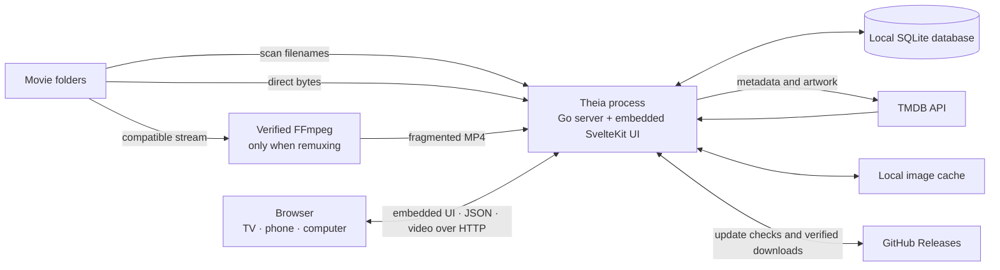

<p align="center">
  
</p>

# Theia

Your films. One binary. Your network.

Theia turns folders of movie files into a browser-based library for the TV,
phone and computer already in your home. There is no account, subscription,
cloud library, Docker ceremony or separate frontend to install. Run the binary,
choose the folders, watch.

The v1 scope is complete and published as
[v1.0.0](https://github.com/Benitoow/theia-media/releases/tag/v1.0.0).
The interface is available in French and English. French remains the default.

> [!WARNING]
> **Theia has no authentication. Never expose its port directly to the
> internet.** It listens on the local network, and anyone who can reach it can
> browse and stream the library, change settings, start a scan and install an
> available update. Use Theia on a trusted home network. For access away from
> home, use a VPN; do not forward port `8383` on the router.

## See it


| First connection | Settings |
| --- | --- |
|  |  |

## What v1 does

- Scans one or more folders at startup or on demand and keeps a local SQLite
  catalogue.
- Extracts a useful title and year from ordinary release filenames. A file
  still appears when parsing or metadata matching fails.
- Fetches movie titles, synopses, dates, posters, backdrops, runtime, rating,
  director, genres and cast from TMDB. Images are cached locally.
- Builds a television-first home screen around what you were watching: a hero
  that offers to resume the film you left, then continue-watching, recently
  added, best rated and a nightly suggestion. Each row leads to the full library
  pre-filtered.
- Gives the whole catalogue its own page, with search across title, director,
  genre and year, five sorts and filters by genre and watch state.
- Shows a detail page for every film, including the source filename and size.
- Direct-plays browser-ready files with range requests.
- Remuxes other compatible containers on demand. Video is copied; incompatible
  audio is converted to AAC.
- Saves playback position, resumes a film and lets remuxed streams seek by
  restarting at the requested timestamp.
- Offers French and English interface catalogues. The language can be changed
  immediately from Settings and is remembered by that browser, without changing
  the language on another television, phone or computer.
- Shows a numeric LAN address and QR code on first launch. `theia.local` is a
  convenience, never the only route.
- Checks GitHub Releases for updates and installs one only when asked. An update
  is refused while something is playing.

All configuration, catalogue data, cached artwork and the optional FFmpeg
binary stay on the machine running Theia. The browser talks to that machine,
not to TMDB.

## What v1 deliberately does not do

| Not included | Consequence |
| --- | --- |
| TV series | The catalogue model is films only. There are no seasons or episodes. |
| Subtitles | Neither external nor embedded subtitle tracks are exposed in the player. |
| Video transcoding | MPEG-2, VC-1 and other video codecs that need re-encoding are refused instead of pinning the CPU for hours. |
| Accounts or permissions | There is no login, password or access control. See the warning above; it is not decorative. |
| Built-in remote access or HTTPS | Theia serves plain HTTP on the LAN. It is not a relay, reverse proxy or VPN. |
| PWA or native TV/mobile apps | The shipped client is a responsive web interface. |
| Background-service installer | The binary runs in the foreground. Starting it at boot is left to the operating system. |
| Manual TMDB matching | Search exists, over what has already been matched. Correcting a *wrong* match is done by renaming the file, which makes the next scan look it up again. |

The reasoning behind these boundaries lives in
[the decision record](docs/DECISIONS.md). They are scope decisions, not
half-finished menu items.

## Install

Download the binary for your operating system and CPU from
[GitHub Releases](https://github.com/Benitoow/theia-media/releases/latest).
Release assets are raw executables: there is no installer and no archive to
unpack.

Choose the right architecture:

| Machine | Release suffix |
| --- | --- |
| Intel or AMD 64-bit | `amd64` |
| Apple silicon, Windows on ARM or 64-bit ARM Linux | `arm64` |

Theia runs in the foreground. Keep its terminal open while using it.

### Windows

Download `theia-windows-amd64.exe` or `theia-windows-arm64.exe`, then run it
from PowerShell:

```powershell
cd $HOME\Downloads
.\theia-windows-amd64.exe
```

Use the `arm64` filename on Windows on ARM. If Windows Firewall asks, allow
access on **private networks** so televisions and phones on the same LAN can
connect. The release workflow does not code-sign the executable, so Windows
may show a first-run reputation warning.

### macOS

Use `theia-darwin-arm64` on Apple silicon and `theia-darwin-amd64` on an Intel
Mac:

```bash
cd ~/Downloads
chmod +x theia-darwin-arm64
./theia-darwin-arm64
```

The release workflow does not sign or notarize the binary. If macOS blocks the
first launch, attempt it once, then approve it under **System Settings →
Privacy & Security → Open Anyway**. That exception should name the binary you
just downloaded; if it does not, stop.

### Linux

Use `theia-linux-amd64` on `x86_64` and `theia-linux-arm64` on `aarch64`:

```bash
cd ~/Downloads
chmod +x theia-linux-amd64
./theia-linux-amd64
```

No system packages are required for direct play. When a film needs remuxing,
Theia downloads its pinned FFmpeg build itself and verifies the SHA-256 digest
before making it executable.

## First launch

1. Open [http://localhost:8383](http://localhost:8383) on the machine running
   Theia.
2. Scan the QR code to open it on another device, or use the numeric network
   address printed in the terminal.
3. Open **Réglages / Settings**, add one or more movie folders, save, then start
   a scan.

The QR code contains an IP address. That is intentional: `theia.local` does not
resolve on Android and is unreliable in some smart-TV browsers. If the first
address is wrong because Docker, a VPN or a virtual machine added extra network
adapters, the welcome and settings screens list the other candidates.

## Configuration

The server has three persisted settings:

| Setting | Purpose |
| --- | --- |
| Watched folders | Directories Theia scans for movie files |
| Port | HTTP port, `8383` by default; takes effect after restart |
| Personal TMDB key | Optional override for the key injected into official release builds |

`hostname` is a fourth field in `config.json`. It controls the mDNS name
(`<hostname>.local`) and is intentionally file-only.

The Settings screen also offers an interface-language selector. It is not a
server setting: French is the default, English is included, and the selection
is kept in that browser's `localStorage`. Two devices may therefore use
different interface languages against the same Theia server.

Changing this selector translates Theia's own controls, labels, messages,
formatters and accessibility names. It does not translate movie content already
cached from TMDB. Existing titles, synopses, genres and credits remain in the
`fr-FR` metadata stored locally, and switching the interface does not download
them again.

The data directory is created on first launch:

| OS | Default data directory |
| --- | --- |
| Windows | `%APPDATA%\Theia` |
| macOS | `$HOME/Library/Application Support/Theia` |
| Linux | `${XDG_CONFIG_HOME:-$HOME/.config}/theia` |

It contains `config.json`, `theia.db`, the image cache and, after the first
remux, the verified FFmpeg binary. Set `THEIA_DATA_DIR` or pass `-data-dir` for
a portable installation.

### Command-line options

| Flag | Effective default | Purpose |
| --- | --- | --- |
| `-port` | `8383` | Override the configured TCP port for this run |
| `-data-dir` | OS path above | Store configuration, database and cache elsewhere |
| `-verbose` | off | Log every HTTP request |
| `-version` | — | Print the version and exit |

## Playback contract

Theia does not pretend every codec is cheap to support.

| Input | Delivery |
| --- | --- |
| Browser-ready MP4, M4V, WebM, OGV or OGG | Direct play, byte for byte, with range requests |
| H.264, VP8, VP9 or AV1 in another container, with browser-ready audio | Remux to fragmented MP4; video and audio copied |
| Same video with AC3, DTS, TrueHD or another unsupported audio codec | Remux; video copied, audio converted to stereo AAC |
| HEVC / H.265 | Remux attempted; normally works in Safari, browser support elsewhere varies |
| MPEG-2, VC-1 or another unsupported video codec | Refused; v1 does not transcode video |

FFmpeg is fetched only when a remux is first needed. The source is the pinned
`eugeneware/ffmpeg-static` release `b6.1.1` on GitHub Releases. Each supported
OS/architecture pair has a hard-coded SHA-256 digest, and the file is not made
executable until it matches.

## Architecture and data flow



The compiled frontend lives inside the Go executable. A normal request serves
the SvelteKit application; `/api/*` handles the catalogue, settings,
playback, onboarding and updater. SQLite stores metadata and playback progress.
Movie files are read from their original folders and
are never imported into a second library.

The only outbound internet destinations in the application are:

- TMDB API and image hosts for metadata and artwork.
- GitHub Releases for Theia updates and the pinned FFmpeg download.

There is no telemetry, analytics endpoint, cloud account or frontend CDN. Fonts
and the frontend ship inside the binary.

## Technical specification

| Layer | v1 implementation |
| --- | --- |
| Server | Go `1.26.5`, standard `net/http`, no CGO |
| Database | SQLite through the pure-Go `modernc.org/sqlite` driver |
| Web UI | Svelte 5, SvelteKit 2, Vite 6 and Tailwind CSS 4 |
| Packaging | Static web build embedded with `go:embed` |
| Discovery | Numeric LAN addresses, QR code and best-effort mDNS |
| Metadata | TMDB API, local 90-day metadata cache, lazy image cache |
| Media | Direct file serving or on-demand FFmpeg remux |
| Distribution | Windows, macOS and Linux; `amd64` and `arm64` |
| Updates | GitHub Releases, digest verification, atomic executable swap |
| Interface language | French by default, English included; browser-local selection |

## Why Theia is small

Three decisions account for almost all of it, and they were taken in the
founding spec rather than discovered later.

**One binary, and nothing beside it.** The Go server, the SQLite driver, the
compiled Svelte frontend and both WOFF2 fonts are linked into a single
executable with `go:embed`. There is no application server to install, no
`node_modules` on the host, no web server in front and no separate database
process. Copying one file onto a machine is the whole installation.

**No CGO.** The database driver is `modernc.org/sqlite`, a pure-Go
implementation, so `CGO_ENABLED=0` holds everywhere. That is what makes a static
cross-compiled binary possible for six targets from one CI job, and it is why
there is no libc version to match on the target machine.

**No language runtime.** Go compiles to native code. Nothing needs .NET, a JVM,
Python or Node.js present at run time.

The one runtime dependency is **FFmpeg**, and only for files that need
remuxing. Theia downloads a pinned, checksum-verified build on first need — not
on first launch — into its own data directory. A library of browser-ready files
never triggers the download at all.

### Measured, not estimated

Taken on Windows 11 (`amd64`) against the development library of **274 films**,
using the binary built from this repository. Reproduce them with
`Get-Process theia` and `Get-ChildItem` on the data directory.

| Measurement | Value |
| --- | --- |
| Binary on disk | **13.5 MB** (release assets are 12–13 MB per platform) |
| Resident memory, just started | **18.8 MB** |
| Resident memory, after serving the home screen and all 274 films | **23.5 MB** |
| Resident memory, during direct playback | **23.8 MB** — unchanged |
| CPU for 20 MB of direct playback | **0.02 s**, streamed at 405 MB/s |
| SQLite database, 274 films indexed | **0.52 MB** |
| Cached TMDB images, 139 fetched so far | **6.9 MB**, grows lazily |
| FFmpeg, once downloaded | **79 MB** — larger than Theia itself |

Direct playback costs essentially nothing because it is a file being served over
a range request; the process does not grow and the CPU barely registers. Remuxed
playback is different and does spend CPU, on FFmpeg rather than on Theia.

**Recommended for a household library of a few hundred films:** any x86-64 or
arm64 machine with **512 MB of free RAM** and **1 GB of free disk** beyond the
media itself — roughly twenty times the memory measured above, which is the
headroom, not the requirement. A `linux/arm64` build ships, so a single-board
computer is in scope on paper; nothing smaller than the Windows machine above
has been tested, and that is worth saying rather than implying.

The constraint that dominates is neither CPU nor memory: it is whether a file
can be **direct-played or remuxed**. A codec that would need re-encoding is
refused rather than attempted, so Theia never becomes the process that pins a
CPU for three hours. See [Playback contract](#playback-contract).

## How Theia compares

Theia is not trying to beat Plex, Jellyfin or Emby. It does far less than any of
them on purpose. This table is here so the trade is legible before you install
anything — several rows go against Theia, and they are the rows most people
should weigh most heavily.

| | **Theia** | **Plex** | **Jellyfin** | **Emby** |
| --- | --- | --- | --- | --- |
| Licence | GPL-3.0 | Proprietary | GPL-2.0 | Server closed-source since 3.5.3 (2018) |
| Cost | Free, no tier above it | Free tier; Plex Pass paid | Free, [no premium features](https://github.com/jellyfin/jellyfin) | Free tier; [Emby Premiere](https://emby.media/premiere.html) paid |
| Runtime dependency | None (FFmpeg on demand) | Bundled | .NET | .NET / Mono |
| External database | No, one SQLite file | No | No | No |
| Account required | **None at all** | A plex.tv account claims the server; [claiming sends its private and public IP to plex.tv](https://support.plex.tv/articles/218136308-why-is-there-an-unclaimed-media-server-on-my-network/) | Local accounts, self-hosted | Local accounts; optional Emby Connect |
| Authentication | **None** — LAN only, by design | Yes, per user | Yes, per user | Yes, per user |
| Updates | GitHub Releases, SHA-256 digest verified, atomic swap, rollback kept | In-app / packaged | Package manager, Docker | In-app / packaged |
| Configuration to start | None | Guided setup | Guided setup | Guided setup |
| **TV series** | **No** — films only | Yes | Yes | Yes |
| **Live TV and DVR** | **No** | Yes (Plex Pass) | Yes | Yes (Premiere) |
| **Video transcoding** | **No** — refused, not attempted | Yes, incl. hardware | Yes, incl. hardware | Yes, incl. hardware |
| **Client apps** | **Browser only** | TV, mobile, console, browser | TV, mobile, browser | TV, mobile, browser |
| **Plugin ecosystem** | **None** | Yes | Yes | Yes |
| Multi-user | No | Full user management | Full user management | Full user management |

**On the sizes.** Only Theia's figures above were measured. Plex, Jellyfin and
Emby were not installed on the same machine, so no install-size comparison is
claimed here — the structural difference is the row that matters: they ship a
bundled runtime and Theia does not.

**Read the bold rows first.** If you want series, live TV, hardware transcoding
or an app on your television, one of the other three is the right answer and
Theia is not. Theia is for one person with a folder of films who wants a single
file to run and nothing to sign into.

Sources: [Jellyfin](https://github.com/jellyfin/jellyfin),
[Plex server claiming](https://support.plex.tv/articles/218136308-why-is-there-an-unclaimed-media-server-on-my-network/),
[Plex local-network authentication](https://support.plex.tv/articles/200890058-authentication-for-local-network-access/),
[Emby licensing history](https://en.wikipedia.org/wiki/Emby).
Competitor details were correct when checked in July 2026; their projects move,
so verify anything you are deciding on.

## Build from source

Use Go `1.26.5` and Node.js `22`, the versions used by the module and CI.

### macOS or Linux

```bash
git clone https://github.com/Benitoow/theia-media.git
cd theia-media
make
./theia
```

`make` runs `npm ci`, creates the static frontend in `web-dist/`, then builds a
CGO-free binary with that frontend embedded.

### Windows

```powershell
git clone https://github.com/Benitoow/theia-media.git
cd theia-media
.\build.ps1
.\theia.exe
```

Pass `-Version 1.0.0` to `build.ps1` when a local build needs a real version
string. Builds left at `dev` deliberately do not self-update.

### Frontend development

Install the web dependencies once, then run the Go API and Vite in separate
terminals:

```bash
# terminal 1, repository root
go run ./cmd/theia

# terminal 2
cd web
npm ci
npm run dev
```

Vite proxies `/api` to `http://localhost:8383`.

For a development TMDB key, create `config.local.json` in the repository root:

```json
{
  "tmdb_api_key": "your-key"
}
```

That file is ignored by Git, never copied into the saved user configuration and
redacted in logs. Do not commit it. Release keys are injected by CI at build
time; they do not live in this repository.

### Checks

```bash
go test ./...
go vet ./...
node scripts/contrast.mjs
node web/scripts/check-locales.mjs
```

The frontend build also rejects French and English catalogues whose keys, value
types or formatter signatures no longer match. CI builds that frontend and
cross-compiles all six release targets with `CGO_ENABLED=0`.

## Repository map

```text
cmd/theia/           startup and process orchestration
internal/api/        HTTP routes, static UI and playback endpoints
internal/config/     config file and data-directory rules
internal/db/         SQLite opening, state and migrations
internal/discovery/  LAN address ranking, mDNS and QR generation
internal/ffmpeg/     pinned download, probing and remux process
internal/imagecache/ lazy TMDB artwork cache
internal/library/    catalogue, scans, metadata and playback progress
internal/scanner/    filesystem walk and media-file filtering
internal/stream/     direct-play/remux decisions
internal/tmdb/       TMDB client and result matching
internal/updater/    release checks and reversible self-update
web/                 SvelteKit source
web/src/lib/i18n/    reactive locale state and French/English catalogues
web-dist/            generated static frontend embedded into the binary
docs/                founding spec, design system and decision record
assets/              licensed source imagery and brand assets
```

Read [docs/spec-fondatrice.md](docs/spec-fondatrice.md) first. Read
[docs/design-system.md](docs/design-system.md) before changing the interface.
Read [docs/DECISIONS.md](docs/DECISIONS.md) before reopening a scope argument
the code has already settled.

## Licence and attribution

Theia is free software under the
[GNU General Public License v3.0](LICENSE).

Metadata and artwork come from [TMDB](https://www.themoviedb.org/):

> This product uses the TMDB API but is not endorsed or certified by TMDB.

FFmpeg is downloaded on demand from its upstream GitHub release and remains
under its own licence. Inter and Playfair Display are self-hosted under the SIL
Open Font License 1.1.
