<p align="center">
  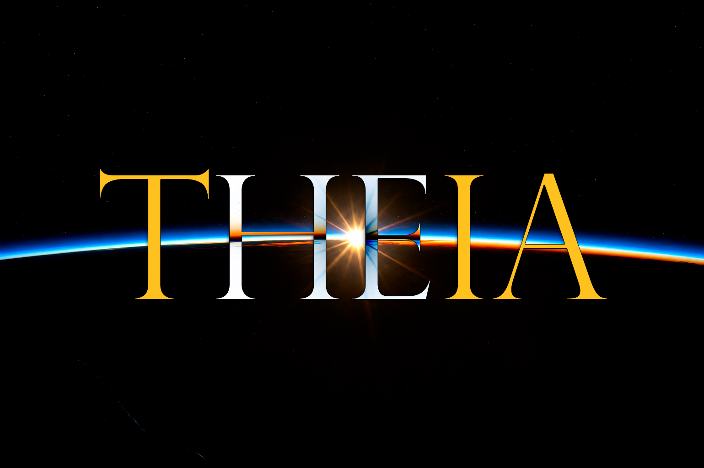
</p>

<h1 align="center">Theia</h1>

<p align="center">
  <strong>Your films and series. One binary. Your network.</strong>
</p>

<p align="center">
  <a href="https://github.com/Benitoow/theia-media/releases/latest"></a>
  <a href="https://github.com/Benitoow/theia-media/actions/workflows/ci.yml"></a>
  <a href="LICENSE"></a>
  
  
  
</p>

<p align="center">
  <a href="https://benitoow.github.io/theia-media/"><strong>theia-media</strong></a> ·
  <a href="https://github.com/Benitoow/theia-media/releases/latest">Download</a> ·
  <a href="#what-theia-does">What it does</a> ·
  <a href="#what-theia-deliberately-does-not-do">What it refuses</a>
</p>

Theia turns folders of movie and series files into a browser-based library for
the TV, phone and computer already in your home. There is no account, no
subscription, no cloud library, no Docker ceremony and no separate frontend to
install. Run the binary, choose the folders, watch.

Everything stays on your machine. The only outbound connections Theia ever makes
are to TMDB for metadata and to GitHub Releases for its own updates.

> [!WARNING]
> **Theia has no login on its LAN port. Never expose TCP `8383` directly to the
> internet.** Anyone who can reach it on your network can browse and stream the
> library, change settings, start a scan and install an update. That is a
> deliberate design decision for a single-household server on a trusted network,
> not an oversight — see [decision 6](docs/DECISIONS.md).
>
> If you need access from outside the house, use the built-in
> [remote access](#remote-access): a separate, device-keyed WireGuard listener
> with viewer-only capabilities. Do not forward TCP `8383` on the router.

## See it

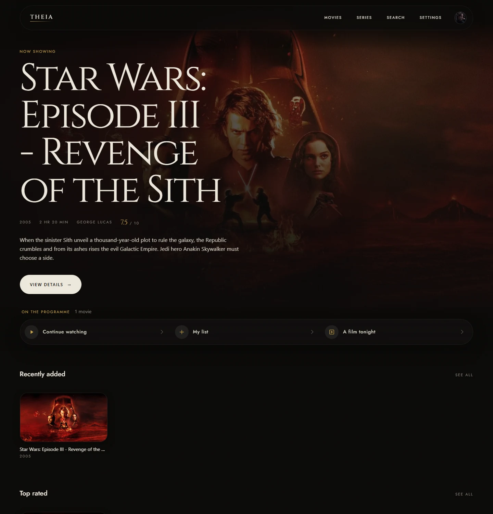

| Every film | Every series |
| --- | --- |
| 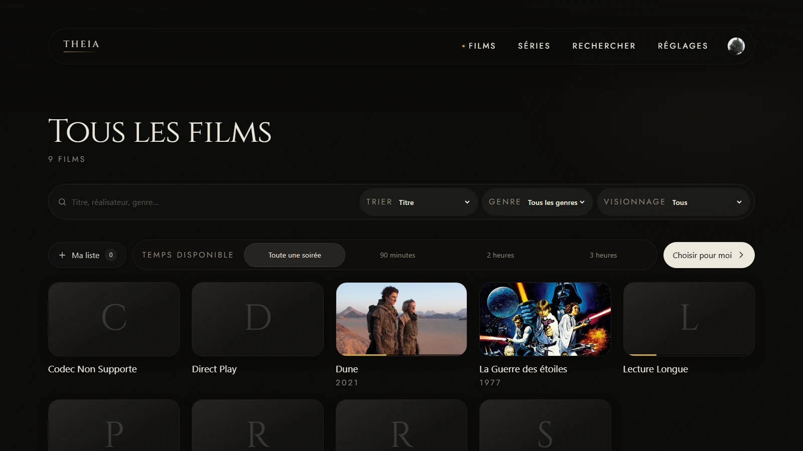 | 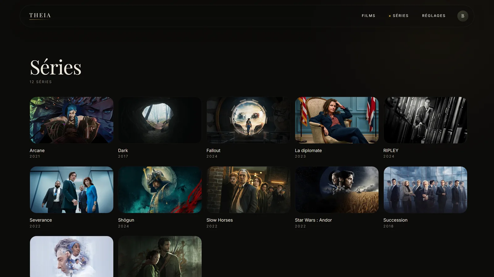 |

| A film, with its record | Who made it, and who is in it |
| --- | --- |
| 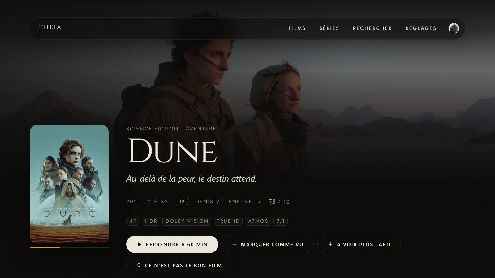 | 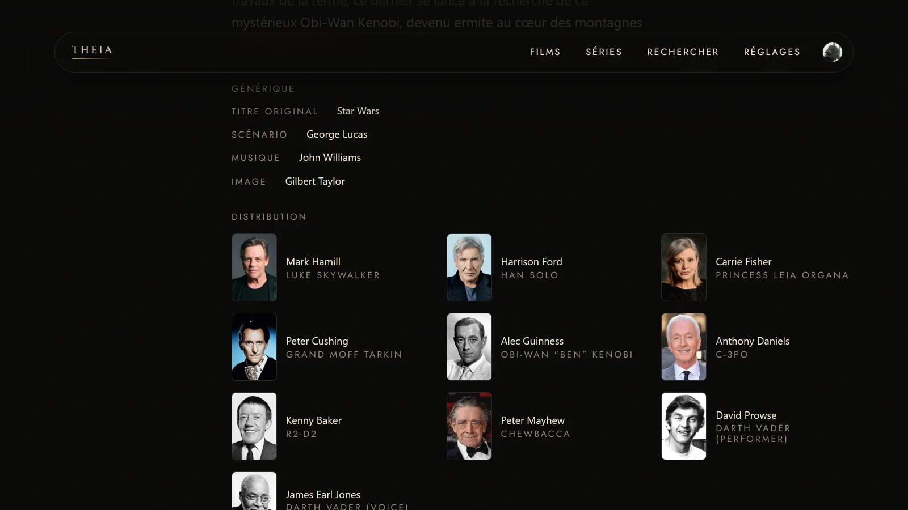 |

| A series, season by season | Remote access |
| --- | --- |
| 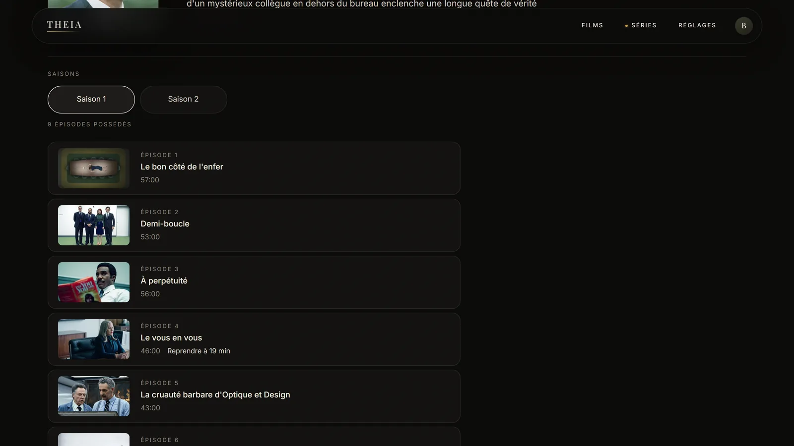 | 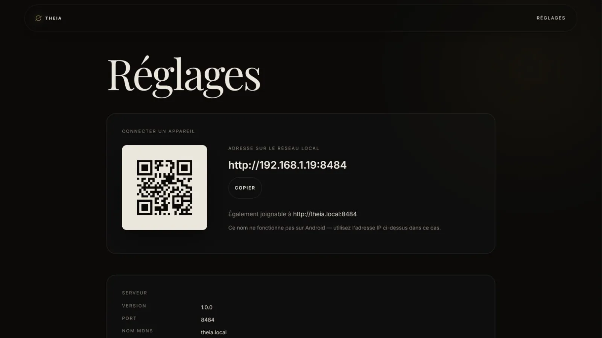 |

| First launch | Who is watching |
| --- | --- |
| 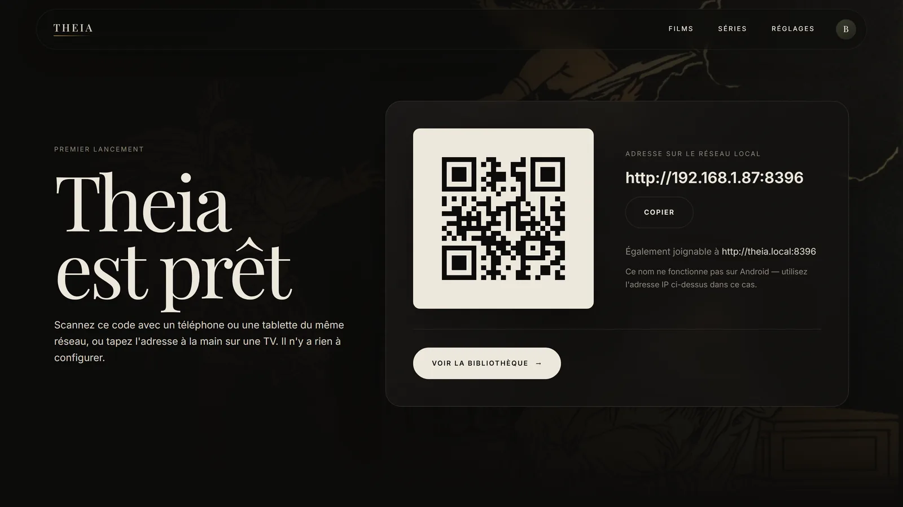 | 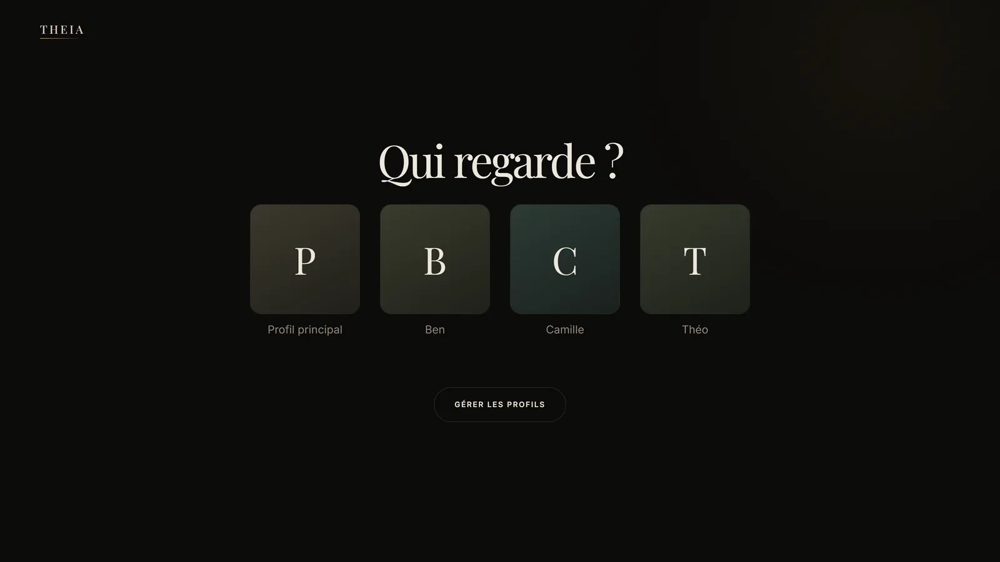 |

Shown in French, the default. English is a complete second catalogue and switches
without a reload. Titles, synopses and artwork come from TMDB.

## What Theia does

**Library**

- Scans one or more folders and keeps a local SQLite catalogue. It then **keeps
  watching them**: a film dropped into a folder is indexed on its own, without
  anybody opening the settings page. A file still being copied is left alone
  until it has finished arriving.
- Extracts a useful title and year from ordinary release filenames. A file still
  appears when parsing or metadata matching fails.
- Lets you **correct a wrong match**: the film page offers the records TMDB
  returned and passed over, and the one you choose is kept — later refreshes
  re-read that record by id instead of searching the filename again.
- Groups several files under one film — a remux and a 1080p encode are one card,
  not two — and lets you pick the file on the detail page.
- Handles **TV series**: shows, seasons, episodes and per-episode resume.
- Fetches the whole TMDB record, not a corner of it: titles and original titles,
  taglines, synopses, dates, posters, backdrops, runtime, rating, age certificate
  with the country that issued it, genres, the director, the writing, music and
  photography credits, and the cast **with their portraits**. A series also
  carries its network, whether it has ended, and the year it stopped. Images are
  cached locally, and all of it arrives in the single request the poster already
  cost.
- Shows **the other parts of a saga you own**. A film TMDB files under a
  collection carries a row of the rest of that collection — only the parts
  actually in the library, because a card for a film you cannot play is an
  advertisement.

**Watching**

- A home screen built around what you were watching: a hero that offers to resume
  the film you left, then continue-watching, recently added, best rated and a
  nightly suggestion. Each row leads to the full library, pre-filtered.
- A library page with search across title, director, genre and year, five sorts
  and filters by genre and watch state.
- One **search across films and series at once**, answered by the server, so a
  phone on the remote link asks a question instead of downloading the catalogue
  to filter it.
- **Marking a film or episode watched by hand**, for the one abandoned halfway
  that nothing will ever finish, and for the one already seen somewhere else.
- A player with audio, subtitle and quality selection while the film runs.
  Subtitles come from embedded text tracks or `.srt` files sitting beside the
  media, and are drawn by Theia rather than by the browser so they land on the
  picture instead of in the letterbox.
- Playback position saved continuously, with resume, and seeking that works even
  on a remuxed stream.
- **Frames under the seek bar**: a strip of thumbnails built from the file's
  keyframes the first time it is opened, so dragging shows the scene rather than
  only a timestamp. Built only if ffmpeg is already on disk — asking for one
  never downloads it.

**Household**

- **Profiles**: a name, an optional local photo and a separate resume history.
  No password, no role, no account — see [decision 31](docs/DECISIONS.md).
- **Remote access**: an embedded userspace WireGuard listener with one-time
  device provisioning and revocation. It asks the router for a port over UPnP or
  NAT-PMP, both of which speak only to your own gateway. There is no relay, no
  rendezvous server and no control plane.
- **Two languages**: French by default, English included. The choice belongs to
  each browser and changes immediately, without touching another screen in the
  house.

**Operations**

- Shows a numeric LAN address and QR code on first launch. `theia.local` is a
  convenience, never the only route.
- Checks GitHub Releases for updates and installs one only when asked. An update
  is refused while something is playing, and is reversible if the new binary
  fails to start.
- Reports what it measured about the machine rather than what it assumed: the
  ffmpeg state, the encoders that actually answered and whether each runs on the
  graphics card or the processor, the hardware decoder, the size of the artwork
  cache and what the last scan did. Nothing is downloaded in order to answer.
- **Sends less down the wire.** Text answers — the catalogue, the interface, the
  subtitles — travel compressed, on the LAN and through the tunnel alike; films,
  artwork and anything asked for by byte range never are. Card artwork is offered
  at three widths and the browser takes the one it can actually show, so a 1080p
  television downloads a quarter of the picture a high-density phone does. A list
  carries what a card reads and no more: the cast, the credits and the certificate
  travel when you open a film, not when you scroll past it. See
  [decisions 74, 75 and 85](docs/DECISIONS.md).

## What Theia deliberately does not do

| Not included | Consequence |
| --- | --- |
| Accounts or permissions | There is no login, password or access control on the LAN. See the warning above; it is not decorative. |
| Editing metadata by hand | A wrong match can be *replaced* with another TMDB record (see above), but no title, synopsis, poster or cast can be typed in. Theia shows what TMDB holds, or the filename. |
| Image subtitles | PGS and VobSub tracks cannot be shown without burning them into the picture. They are named rather than silently missing, and only when the file has no text track at all. Text tracks **can** be nudged in and out of sync, half a second a press, when a rip was muxed from a different cut. |
| HTTPS on the LAN | Theia serves plain HTTP locally. Remote access is encrypted by WireGuard instead. |
| PWA or native TV/mobile apps | The shipped client is a responsive web interface, built for a D-pad. |
| Background-service installer | The binary runs in the foreground. Starting it at boot is left to the operating system. |
| Live TV, DVR, plugins | Out of scope, permanently. |

The reasoning behind each boundary lives in
[the decision record](docs/DECISIONS.md). They are scope decisions, not
half-finished menu items.

## Install

Download the binary for your operating system and CPU from
[GitHub Releases](https://github.com/Benitoow/theia-media/releases/latest).
Release assets are raw executables: there is no installer and no archive to
unpack.

| Machine | Release suffix |
| --- | --- |
| Intel or AMD 64-bit | `amd64` |
| Apple silicon, Windows on ARM or 64-bit ARM Linux | `arm64` |

Theia runs in the foreground. Keep its terminal open while using it.

### Windows

```powershell
cd $HOME\Downloads
.\theia-windows-amd64.exe
```

Use the `arm64` filename on Windows on ARM. If Windows Firewall asks, allow
access on **private networks** so televisions and phones on the same LAN can
connect. The release workflow does not code-sign the executable, so Windows may
show a first-run reputation warning.

### macOS

```bash
cd ~/Downloads
chmod +x theia-darwin-arm64
./theia-darwin-arm64
```

Use `theia-darwin-amd64` on an Intel Mac. The release workflow does not sign or
notarize the binary. If macOS blocks the first launch, attempt it once, then
approve it under **System Settings → Privacy & Security → Open Anyway**. That
exception should name the binary you just downloaded; if it does not, stop.

### Linux

```bash
cd ~/Downloads
chmod +x theia-linux-amd64
./theia-linux-amd64
```

Use `theia-linux-arm64` on a 64-bit ARM machine such as a Raspberry Pi.

## First launch

Theia listens on `http://localhost:8383` and prints the addresses it can be
reached at. The first screen shows a QR code for the LAN address: scan it from a
phone on the same network, or type the address into a television browser.

Then open **Settings**, add one or more folders, and start a scan. Nothing is
copied or moved; Theia reads your files where they already are.

## Configuration

Configuration lives in a single JSON file in Theia's data directory. Everything
in it can also be changed from the Settings screen, so editing it by hand is
optional.

| Platform | Data directory |
| --- | --- |
| Windows | `%APPDATA%\Theia` |
| macOS | `~/Library/Application Support/Theia` |
| Linux | `~/.config/theia` |

That directory holds the configuration, the SQLite catalogue, the cached artwork
and — only once something needs it — the verified FFmpeg binary.

### Command-line options

| Flag | Meaning |
| --- | --- |
| `-port` | TCP port to listen on, overriding the configuration file |
| `-data-dir` | Directory holding configuration, database and cache |
| `-verbose` | Log every HTTP request |
| `-version` | Print the version and exit |

### TMDB key

A key ships with the official release binaries. You can supply your own from
Settings if you would rather spend your own quota; a key entered there takes
priority.

## Remote access

Remote access is off until you turn it on. When you do, Theia:

1. generates a device key pair and shows a one-time provisioning payload;
2. asks the router for a UDP port over UPnP IGD or NAT-PMP — the request goes to
   your gateway and nowhere else;
3. accepts encrypted WireGuard traffic from that device only.

A remote device reaches a fixed in-process address after the handshake and
receives catalogue, image, stream, inspection and progress capabilities. It does
**not** receive settings, scans, onboarding, updates or device management. The
tunnel creates no operating-system network interface and does not route the rest
of that device's internet traffic through your house.

Devices can be revoked individually. If the router refuses to open a port, Theia
says so and offers the manual port and endpoint rather than pretending.

## Playback contract

Theia does not pretend every codec is cheap to support.

| Input | Delivery |
| --- | --- |
| Browser-ready MP4, M4V, WebM, OGV or OGG | Direct play, byte for byte, with range requests |
| H.264, VP8, VP9 or AV1 in another container, with browser-ready audio | Remux to fragmented MP4; video and audio copied |
| Same video with AC3, DTS, TrueHD or another unsupported audio codec | Remux; video copied, audio converted to stereo AAC |
| HEVC / H.265 | Remux attempted first, because copying is lossless and free. If the browser cannot keep up, Theia re-encodes **at the source resolution** and remembers that verdict for next time |
| MPEG-2, VC-1 or another codec no browser decodes | Re-encoded to H.264, if this machine has an encoder that runs |

**Encoders are probed and decoders are timed, never assumed.** The pinned FFmpeg
build lists every accelerator on every platform because they are all compiled
in; whether one *starts* depends on the card and the driver. Each encoder
candidate is asked to encode one frame, once, on the first playback that needs
it — on the developer's AMD machines three of seven start.

Decoding gets more than a probe, because starting is not the same as being
faster. The same `-hwaccel d3d11va` was measured **22% faster** than software on
an AMD desktop with a card of its own and **30% slower** on a laptop whose GPU
shares memory with the CPU: without a GPU filter chain, hardware decoding copies
every frame back for the scaler, and whether that copy is worth making is a
property of the machine. So Theia builds two seconds of test video, times
software decoding and each candidate against it, and takes a hardware path only
if it is at least 10% faster. Software decoding keeps every tie — it is correct
everywhere and costs nothing to be wrong about. The whole measurement takes
under a second, once, on the first transcode.

Software encoding is tuned for a buffered stream rather than a video call, which
is what it is: dropping `-tune zerolatency` and capping x264 at
`min(NumCPU, 8)` threads measured **18% more throughput**, with B-frames and
lookahead back at the same bitrate, for 142 ms more before the first fragment.
See [decisions 58 to 60](docs/DECISIONS.md) and
[76 to 77](docs/DECISIONS.md).

One software transcode runs at a time. Two concurrent ones do not run at half
speed; they both stall, and nobody watching either can tell why.

FFmpeg is fetched only when first needed, from the pinned
`eugeneware/ffmpeg-static` release `b6.1.1`. Each OS/architecture pair has a
hard-coded SHA-256 digest, and the file is not made executable until it matches.

## Architecture and data flow

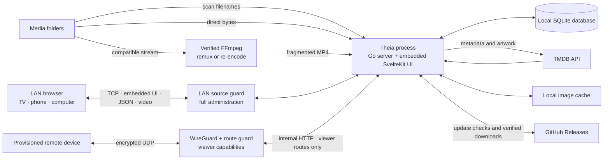

The compiled frontend lives inside the Go executable. A normal request serves the
SvelteKit application; `/api/*` handles the catalogue, settings, playback,
profiles, onboarding, remote access and the updater. SQLite stores metadata and
per-profile playback progress. Media files are read from their original folders
and are never imported into a second library.

There is no telemetry, analytics endpoint, cloud account or frontend CDN. Fonts
and the frontend ship inside the binary.

## Technical specification

| Layer | Implementation |
| --- | --- |
| Server | Go `1.26.5`, standard `net/http`, no CGO |
| Database | SQLite through the pure-Go `modernc.org/sqlite` driver |
| Web UI | Svelte 5, SvelteKit 2, Vite 6 and Tailwind CSS 4 |
| Packaging | Static web build embedded with `go:embed` |
| Discovery | Numeric LAN addresses, QR code and best-effort mDNS |
| Metadata | TMDB API, local 90-day metadata cache, lazy image cache |
| Media | Direct play, on-demand remux, or hardware-probed re-encode |
| Remote access | Embedded `wireguard-go` + userspace netstack; device keys, no control plane |
| Distribution | Windows, macOS and Linux; `amd64` and `arm64` |
| Updates | GitHub Releases, digest verification, atomic executable swap, rollback |
| Interface | French and English, browser-local selection |

## Why Theia is small

Three decisions account for almost all of it, and they were taken in the founding
spec rather than discovered later.

**One binary, and nothing beside it.** The Go server, the SQLite driver, the
compiled Svelte frontend and both WOFF2 fonts are linked into a single executable
with `go:embed`. There is no application server to install, no `node_modules` on
the host, no web server in front and no separate database process.

**No CGO.** The database driver is `modernc.org/sqlite`, a pure-Go
implementation, so `CGO_ENABLED=0` holds everywhere. That is what makes a static
cross-compiled binary possible for six targets from one CI job, and why there is
no libc version to match on the target machine.

**No language runtime.** Go compiles to native code. Nothing needs .NET, a JVM,
Python or Node.js present at run time.

The one runtime dependency is **FFmpeg**, and only for files that need remuxing
or re-encoding. Theia downloads a pinned, checksum-verified build on first need —
not on first launch.

### Measured, not estimated

Taken on Windows 11 (`amd64`, Ryzen AI 9 HX 370, 12 cores, Radeon 890M) against
the development library, using the binary built from this repository. Reproduce
them with `Get-Process theia` and `Get-ChildItem` on the data directory.

| Measurement | Value |
| --- | --- |
| Binary on disk | **17.1 MB** |
| Resident memory, just started | **18.0 MB** |
| Resident memory, after serving the home screen and the library | **19.1 MB** |
| Resident memory, during a sustained remux | **21.6 MB** |
| CPU for 60 MB of remuxed playback | **0.03 s**, at 79 MB/s |
| SQLite catalogue | **0.80 MB** |
| Cached TMDB artwork, 323 images | **19.4 MB**, grows lazily |
| FFmpeg, once downloaded | **79 MB** — larger than Theia itself |

Serving a film costs essentially nothing: the process does not grow and the CPU
barely registers, because it is a file being read and written to a socket.
Re-encoding is different and does spend a GPU or a core, on FFmpeg rather than on
Theia.

What crosses the network, on the same 192-film bench, is the part that matters
for a television on Wi-Fi or a phone down the tunnel:

| Response | Sent | Compressed |
| --- | --- | --- |
| Film catalogue, whole library | 148,142 B | **20,860 B** |
| Home screen | 29,488 B | **4,422 B** |
| Stylesheet | 74,613 B | **19,942 B** |
| One card's artwork on a 1080p television | 80,499 B at `w780` | **22,552 B at `w342`** |

Video, images and any request carrying a `Range` header are deliberately left
alone: a film is already compressed, and a compressed body would make the byte
offsets a player seeks to mean nothing.

## System requirements

| | Minimum | Recommended |
| --- | --- | --- |
| CPU | Any 64-bit `x86-64` or `arm64` | 4 cores, if you ever re-encode |
| Free RAM | 256 MB | 1 GB |
| Free disk, beyond the media | 200 MB | 500 MB |
| Network to the viewer | 100 Mbit/s wired, or 5 GHz Wi-Fi | Gigabit wired, for 4K remux |
| Client | A browser that decodes the file's codec | The same, on a screen you own |

**These are generous.** Theia's own resident memory is 18–22 MB; the 256 MB floor
is there so the operating system still has page cache to read media with, not
because the process needs it. The 200 MB of disk is 17 MB of binary, 79 MB of
FFmpeg once it is fetched, and room for the catalogue and the artwork.

**How the disk grows.** The catalogue is **0.53 MB** for 40 films, 12 series and
151 episodes. Artwork is cached lazily, only for what has actually been shown, at
about **60 KB per image** — measured twice, 4.2 MB across 71 images and 19.4 MB
across 323. Extrapolating rather than measuring: a thousand films with a poster
and a backdrop each is roughly **120 MB** of artwork, and the catalogue stays in
single-digit megabytes.

**The network is the limit, not the server.** Direct play and remux are a file
being read and written to a socket; locally that ran at **79 MB/s**, which is
632 Mbit/s. What has to fit is the file's own bitrate: a 1080p x265 encode is
typically 4–10 Mbit/s, a 1080p Blu-ray remux 20–40, and a 4K remux can pass 80.
Those three are typical figures, not measurements.

**Re-encoding is the one expensive path**, and only for codecs no browser
decodes, or for HEVC a browser turns out not to keep up with. On the machine
above, one 1080p software re-encode runs at about **8× real time**, and **9.9×**
with `d3d11va` decoding in front of it. One runs at a time by design: two
concurrent transcodes do not each run at half speed, they both stall.

**What has not been tested.** `linux/arm64` and `darwin/arm64` builds ship and CI
cross-compiles all six targets, but nothing smaller than the desktop above has
actually been run. A Raspberry Pi is in scope on paper and unverified in
practice; direct play should be untroubled there and re-encoding almost certainly
will not be. That is worth stating rather than implying.

## How Theia compares

Theia is not trying to beat Plex, Jellyfin or Emby. It does less than any of them
on purpose. This table is here so the trade is legible before you install
anything — several rows go against Theia, and they are the rows most people
should weigh most heavily.

| | **Theia** | **Plex** | **Jellyfin** | **Emby** |
| --- | --- | --- | --- | --- |
| Licence | GPL-3.0 | Proprietary | GPL-2.0 | Server closed-source since 3.5.3 (2018) |
| Cost | Free, no tier above it | Free tier; Plex Pass paid | Free, [no premium features](https://github.com/jellyfin/jellyfin) | Free tier; [Emby Premiere](https://emby.media/premiere.html) paid |
| Runtime dependency | None (FFmpeg on demand) | Bundled | .NET | .NET / Mono |
| External database | No, one SQLite file | No | No | No |
| Account required | **None at all** | A plex.tv account claims the server; [claiming sends its private and public IP to plex.tv](https://support.plex.tv/articles/218136308-why-is-there-an-unclaimed-media-server-on-my-network/) | Local accounts, self-hosted | Local accounts; optional Emby Connect |
| Authentication | **None on the LAN**, by design | Yes, per user | Yes, per user | Yes, per user |
| Remote access | WireGuard, no control plane | Relay via plex.tv | Manual or reverse proxy | Emby Connect |
| Updates | GitHub Releases, SHA-256 verified, atomic, rollback | In-app / packaged | Package manager, Docker | In-app / packaged |
| Configuration to start | None | Guided setup | Guided setup | Guided setup |
| Films and series | Yes | Yes | Yes | Yes |
| Hardware transcoding | Probed encoders and decoders | Yes (Plex Pass) | Yes | Yes (Premiere) |
| **Live TV and DVR** | **No** | Yes (Plex Pass) | Yes | Yes (Premiere) |
| **Client apps** | **Browser only** | TV, mobile, console, browser | TV, mobile, browser | TV, mobile, browser |
| **Plugin ecosystem** | **None** | Yes | Yes | Yes |
| **Music, photos, books** | **No** | Yes | Yes | Yes |
| Multi-user | Local profiles, separate resume, no passwords | Full user management | Full user management | Full user management |

**On the sizes.** Only Theia's figures above were measured. Plex, Jellyfin and
Emby were not installed on the same machine, so no install-size comparison is
claimed here — the structural difference is the runtime row.

**Read the bold rows first.** If you want live TV, an app on your television, a
plugin ecosystem or a music library, one of the other three is the right answer
and Theia is not. Theia is for one household with folders of films and series who
want a single file to run and nothing to sign into.

Sources: [Jellyfin](https://github.com/jellyfin/jellyfin),
[Plex server claiming](https://support.plex.tv/articles/218136308-why-is-there-an-unclaimed-media-server-on-my-network/),
[Plex local-network authentication](https://support.plex.tv/articles/200890058-authentication-for-local-network-access/),
[Emby licensing history](https://en.wikipedia.org/wiki/Emby).
Competitor details were correct when checked in August 2026; their projects move,
so verify anything you are deciding on.

## Build from source

Use Go `1.26.5` and Node.js `22`, the versions used by the module and CI.

### macOS or Linux

```bash
git clone https://github.com/Benitoow/theia-media.git
cd theia-media
make build
./theia
```

### Windows

`build.ps1` uses `go` from `PATH` when there is one, and otherwise looks for
an unpacked toolchain under `%USERPROFILE%\go-toolchain\go`,
`%LOCALAPPDATA%\go` and `C:\Program Files\Go`. If it finds none it says so
before touching anything, rather than rebuilding the frontend and then failing
on the binary.

```powershell
git clone https://github.com/Benitoow/theia-media.git
cd theia-media
.\build.ps1
.\theia.exe
```

Use the script rather than calling `npm run build` directly: the frontend build
wipes `web-dist/`, and `web-dist/.gitkeep` is tracked.

### Frontend development

```bash
# terminal 1, repository root
go run ./cmd/theia

# terminal 2
cd web && npm run dev
```

### Checks

```bash
go test ./...                       # the whole suite
node scripts/contrast.mjs           # guards the documented colour ratios
node web/scripts/check-locales.mjs  # guards French/English catalogue parity
```

### The interface guard

`npm test` in `web/` drives a real browser against the built binary at 375, 1280
and 1920 pixels wide, and asserts the four things that are invisible to the eye:
nothing overflows, every declared font actually loaded, every target clears
44px, and the page has one left edge. It needs a binary — build one first — and
runs on every push. See [decision 82](docs/DECISIONS.md) for the faults that
earned it.

### A library to look at

Judging a grid needs a grid. `go run ./scripts/bench -data <dir>` fills a
throwaway database with as many films as there is cached artwork for, fetching
nothing:

```bash
go run ./scripts/bench -data /tmp/theia-bench -count 250
```

The rows point at paths that do not exist — this builds a library to look at,
not one to play.

## Repository map

```text
cmd/theia/             startup and process orchestration
internal/activity/     playback activity, so an update never interrupts a film
internal/api/          HTTP routes, static UI and playback endpoints
internal/config/       config file and data-directory rules
internal/db/           SQLite opening, state and migrations
internal/discovery/    LAN address ranking, mDNS and QR generation
internal/ffmpeg/       pinned download, probing, remux and encode processes
internal/imagecache/   lazy TMDB artwork cache
internal/library/      catalogue, scans, series, metadata and progress
internal/portmap/      UPnP IGD and NAT-PMP port requests to the gateway
internal/profiles/     household profiles and per-viewer progress
internal/remoteaccess/ embedded WireGuard, peer store and LAN/remote guards
internal/scanner/      filesystem walk and media-file filtering
internal/stream/       direct-play, remux and transcode decisions
internal/subtitles/    embedded tracks and sidecar discovery
internal/tmdb/         TMDB client and result matching
internal/updater/      release checks and reversible self-update
web/                   SvelteKit source
web/src/lib/i18n/      reactive locale state and French/English catalogues
web-dist/              generated static frontend embedded into the binary
docs/                  founding spec, design system and decision record
docs/archive/          the V2 planning documents, kept for their reasoning
site/                  the presentation site, two languages from one template
assets/                licensed source imagery and brand assets
.github/               contribution guide, security policy, issue templates, CI
```

## Why this project uses AI

Theia is written by one person with AI assistants. **About half its commits carry
a `Co-Authored-By: Claude` trailer**, and the trailer is not a complete record —
other assistants contributed without adding one. Count them yourself:

```bash
git log --grep='Co-Authored-By: Claude' --oneline | wc -l
```

Saying so is the point of this section: the code is public and GPL-3.0, and
anyone reading it is entitled to know how it was made.

**Theia itself contains no AI.** No model runs in the binary, nothing is inferred
about your library, nothing is sent anywhere to be analysed. The only outbound
connections are still TMDB and GitHub Releases. This section is about how the
software was written, not about what it does.

### What it changed about the project

The three governing documents are not process theatre; they exist because an
assistant starts every session knowing nothing.

- [`docs/spec-fondatrice.md`](docs/spec-fondatrice.md) states what Theia refuses
  to be, so scope creep has to argue with a document rather than with a mood.
- [`docs/DECISIONS.md`](docs/DECISIONS.md) is append-only in spirit — supersede an
  entry, never quietly rewrite it — because a settled question will otherwise be
  re-opened every few sessions by someone with no memory of settling it.
- [`docs/design-system.md`](docs/design-system.md) fixes colour, type, spacing and
  motion, so "make it look better" cannot mean six different things.

Writing the reasoning down turned out to be worth doing for its own sake. The
decision log is the most useful file in the repository, and it exists because of
how the project is built.

### The standard that makes it work

**Report what you verified, not what you assumed.** The characteristic failure of
an AI assistant is not bad code; it is a confident summary of work it never ran.
So a change here is finished when it has been executed against a real library and
the result observed, and "I could not verify this" is an acceptable answer where
an optimistic one is not.

That standard was not adopted in the abstract. It was bought:

- A shuffle for the nightly suggestion **passed every test** and returned every
  twenty-third film. Two of its three versions failed in ways that read as
  correct. It was caught by printing the ids ([decision 30](docs/DECISIONS.md)).
- The favicon had been **undecodable since M2** because of two hyphens inside an
  XML comment. The file existed, the tests were green, and nothing displayed it.
  It is now verified by loading it into an `Image()` and reading back `32×32`
  ([decision 54](docs/DECISIONS.md)).
- A profile ordering bug **shipped in `v2.0.0`**: on a cold load the player wrote
  its position against the wrong viewer. It was invisible unless the first page
  you landed on was the one that mattered, and it was found while taking a
  screenshot of the feature ([decision 63](docs/DECISIONS.md)).

Every one of those was found by looking at the running product. None would have
been found by reading the diff.

### Where the line is

The maintainer reviews and approves everything, and the constraints in §3 of the
founding spec are not negotiable by an assistant: no CGO, no runtime dependency
beyond FFmpeg, no Docker requirement, no telemetry, and **no unverified image** —
nothing decorative is ever fetched from the web, and every asset in `assets/` is
supplied by the maintainer with its licence checked first.

If that trade does not suit you, the history is public and every claim above is
checkable with `git log`.

## Contributing

Read [CONTRIBUTING.md](.github/CONTRIBUTING.md) first. In short: three documents
govern every change, and reading them answers most questions before they are
asked.

| Document | What it settles |
| --- | --- |
| [docs/spec-fondatrice.md](docs/spec-fondatrice.md) | What Theia is and what it refuses to be |
| [docs/DECISIONS.md](docs/DECISIONS.md) | Every decision already taken, and the bug that forced it |
| [docs/design-system.md](docs/design-system.md) | Colour, type, spacing, motion, focus |

Bugs and ideas go through the [issue templates](.github/ISSUE_TEMPLATE). A
playback report needs the file's codecs, the browser and the mode; without those
it usually cannot be reproduced.

**Security problems are not issues.** Read
[SECURITY.md](.github/SECURITY.md) and report privately. It also explains why the
LAN port has no login, which is a decision rather than a vulnerability.

## Licence and attribution

Theia is free software under the
[GNU General Public License v3.0](LICENSE).

Metadata and artwork come from [TMDB](https://www.themoviedb.org/):

> This product uses the TMDB API but is not endorsed or certified by TMDB.

FFmpeg is downloaded on demand from its upstream GitHub release and remains under
its own licence.

**Fonts.** Two typefaces are self-hosted and embedded in the binary: **Cinzel**
for the display register and **Jost** for labels. Both SIL Open Font License 1.1,
which is GPL-compatible and imposes nothing on the rest of the project. v2.2.0
briefly shipped two faces that were not — see
[decision 81](docs/DECISIONS.md).
