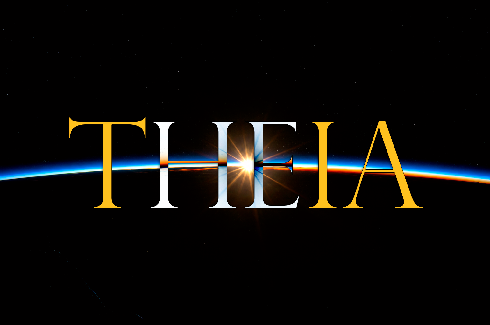
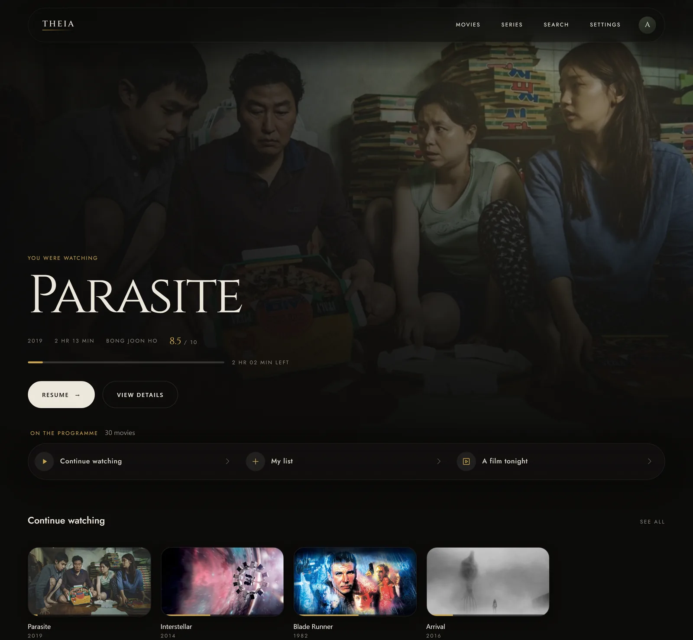
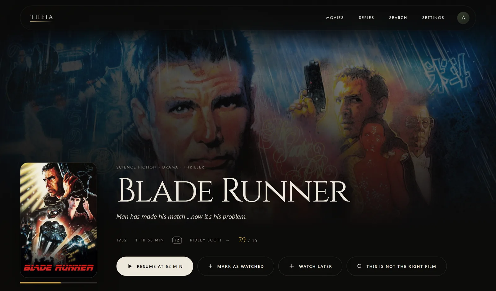
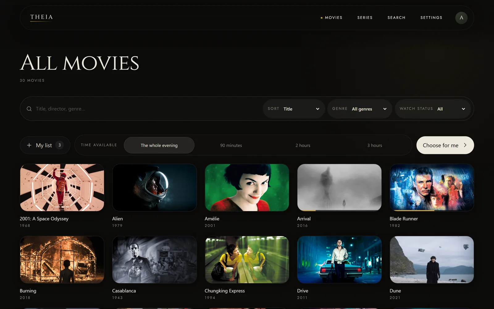

<p align="center">
  
</p>

<h1 align="center">Theia</h1>

<p align="center">
  <strong>Your films and series. Your friends. No account.</strong>
</p>

<p align="center">
  <a href="https://github.com/Benitoow/theia-media/releases/latest"></a>
  <a href="LICENSE"></a>
  
  
  
</p>

<p align="center">
  <a href="https://benitoow.github.io/theia-media/">Website</a> ·
  <a href="#downloads">Downloads</a> ·
  <a href="docs/releases/v4.1.0.md">4.1 release notes</a> ·
  <a href="#three-minute-setup">Setup</a> ·
  <a href="#theia-plex-jellyfin-or-emby">Compare</a> ·
  <a href="https://discord.gg/p4Rp4zHdHf">Discord</a>
</p>



*The home screen of the web interface, in English, on a sample library. Films are watched in the native player.*

Theia turns folders of films and series into a private cinema. A small server
looks after your library, a native desktop player plays it, and your friends can
see what you are watching. There is no cloud account, no telemetry, no Docker
stack and no external database to install.

<table>
  <tr>
    <td width="50%"></td>
    <td width="50%"></td>
  </tr>
</table>

*A film page and the library. The sample library is thirty films and six series, each a two-second clip, so the artwork, synopses and ratings are real TMDB metadata and the files are not films.*

| One download | Built for choosing | Private by default |
| --- | --- | --- |
| One setup includes the server, launcher, native player and media engine. Choose all-in-one, server-only or player-only. FFmpeg is downloaded only when the server needs conversion. | Resume, profiles, watchlists, duration filters, one search across films and series, and a nightly pick. | No telemetry or cloud library. Metadata comes from TMDB; updates come from GitHub Releases. |

## Theia 4.1

> [!IMPORTANT]
> **4.1 is free, like 4.0.** The server, the library, ordinary viewing and everything new
> in this release cost nothing. Theia has reached its core: the installer, the
> player, the server, file recognition, the Linux package and the licence are
> clean, and every change from here will reach everyone for free for a duration
> that is not decided. Which later features might become paid, if any, has not
> been decided either; it will be settled in the open and announced well before
> it happens. Nothing is paid today. [Read the 4.1 release notes](docs/releases/v4.1.0.md).

**New in 4.1**

- **Watch parties.** Open a room from the film you are watching; your friends
  join in one press, on the same library or in another household, and everyone
  stays on the same second. A friend without the film can watch the host's copy.
- **The island,** a pill under the title bar that shows when the film ends,
  who is in the room, who arrives and who is being waited for.
- **Remote access in one press,** asking the router from every interface and
  carrying IPv6 in friend codes; how many friends are online, on the Friends entry.
- **Closing the player closes the server** that was started for it.

**Since 4.0** ([4.0 release notes](docs/releases/v4.0.0.md))

- **Who's watching?** The player asks at startup which profile is watching, and
  remembers the answer.
- **Friends.** Every profile has a code. Enter a friend's code, they accept, and
  you each see what the other is watching right now, on the same library or on
  another server in another house.
- **Discord Rich Presence,** off by default and local to your own Discord client.
- **A rebuilt installer:** one full screen that reads the machine before it asks.
- **Better recognition of your files,** with more title spellings, editions and
  episode patterns.
- **A clean Linux engine:** an LGPL media engine ships with the player, and
  Ubuntu's `libmpv2` is no longer needed.
- **Grouped settings, corner resizing,** and a player that falls back to its own
  server when the chosen one does not answer.

**What comes next.** Comments and likes or dislikes on films remain on the
direction without a date. Direct messages and calls are out of scope.

The native player reads Matroska and renders subtitles through libmpv. Sound
and picture capabilities depend on the operating system and the actual device:
Windows can use supported bitstream outputs, while macOS and Linux use PCM.
Linux uses software decoding and SDR rendering. The server remains a separate Go
binary with SQLite and no graphical dependency.

## Which program goes where

Theia is three programs, and which ones belong on a machine depends on the
house, not on taste.

| Your setup | What to install | Why |
| --- | --- | --- |
| One computer that holds the films and is plugged into the screen | **All-in-one**, the default answer in the installer | It serves and it plays. Nothing travels over the network, so nothing is limited by it. |
| A small machine in a cupboard or a NAS, and a television, a laptop or a desktop you watch on | **Server only** on that machine, then **player only** on each device you watch on | The server indexes, stores and streams; the player uses the sound and picture hardware of the machine in front of you, which is where the difference is heard. |
| A computer that only watches, with the films held elsewhere | **Player only** | No library is scanned or stored locally. It asks the server for the catalogue and the files. |
| A phone, tablet or television browser | **Nothing**; open the address the server prints in a browser | The web viewer remains available. Its viewing features are complete and no longer developed; server settings and administration are still maintained. |

The desktop downloads target Windows x64/ARM64, macOS Intel/Apple Silicon and
Ubuntu 24.04 x64/ARM64. Linux needs X11 or XWayland and the two packages listed
under [Downloads](#downloads). Other Linux distributions are not verified.

## What you get

- **A library that stays current.** Theia scans several folders, watches for new
  files, groups alternate versions under one title and keeps files where they
  already live. Recognition reads French and streaming tags, editions, sequel
  numbers and many episode spellings.
- **Films and series with proper detail pages.** Artwork, synopsis, cast and
  available files, with TMDB metadata cached by the server. You can inspect
  resolution and HDR metadata before playing; device checks describe what the
  driver reports.
- **A cinema that remembers people.** Local profiles keep separate progress,
  watched state and watchlists. Profiles are household identities, not accounts;
  they have no passwords.
- **Friends.** See what the people you chose are watching right now, and nothing
  more: no history, no library, no progress.
- **Playback that remembers.** The player saves your server address, volume, mute
  state and window size. Audio and subtitle preferences apply to films and
  episodes. Series show resume progress and offer the next episode, with optional
  autoplay and time to cancel.
- **A server that adapts.** Direct play, remux and transcoding serve different
  client capabilities. The native player handles its own decoding and subtitles;
  available output formats depend on the platform and device.
- **Access outside the house without a Theia cloud.** The built-in remote mode
  uses device-keyed WireGuard and exposes viewer capabilities only. There is no
  relay, rendezvous server or control plane.
- **Updates with a way back.** Theia verifies release digests, waits for playback
  to stop, swaps the executable atomically and keeps the previous version for
  rollback. The player is updated by the installer the same way:
  `theia-setup --check-player` asks, `--update-player` verifies the published
  digest, runs the new player before replacing anything, and refuses while the
  player is open.

Theia deliberately has no live TV, DVR, music library, plugins or multi-user
permissions. Dedicated phone and TV apps have no announced date; those devices
use the web viewer for now.

## Three-minute setup

1. Download the setup for your computer from [Downloads](#downloads). On
   macOS/Linux, make it executable with `chmod +x <filename>`, then run it. The
   installer is one full-screen program: it starts in your language, suggests
   film folders from your drives, shows its plan before writing anything, and
   updates an existing installation in place instead of starting again.
2. The setup already contains the complete product and installs without
   fetching additional Theia components. Windows installs per user under
   `%LOCALAPPDATA%\Programs\Theia`, adds Start Menu/Desktop entries and
   registers **Settings → Apps** removal. macOS installs under
   `~/.local/lib/theia`, links the app into `~/Applications` and the command
   into `~/.local/bin`. Linux installs under `~/.local/lib/theia`; start the
   `theia` command there. Services remain opt-in and no elevation is required.
3. Start Theia from its entry, or let the installer start it for you. It offers
   an autostart entry (a launchd agent on macOS) and asks for no administrator
   rights. From a terminal, `theia` starts the server if it is not answering
   and then opens the player; `theia server` and `theia player` start one half
   alone, and `theia-server` / `theia-player` run them in the console.
4. Open **Settings**, add or confirm your media folders, then start the scan.

To remove it later, `theia-setup --uninstall` takes away the programs, the entries
and the autostart record, and **keeps your data**: the library, the progress marks
and the configuration stay in `%APPDATA%\Theia` on Windows,
`~/Library/Application Support/Theia` on macOS and `~/.config/theia` on Linux, and
the command says where they are. Custom data locations are kept too. On Windows,
`theia-setup --repair-registration` restores a missing **Settings → Apps** entry
without reinstalling.

## Friends

Each profile has a **friend code**. Open the friends sheet in the player, copy
your code to somebody, and enter theirs.

1. Entering a code sends a request. You are told at once which profile it
   reached, or that the person does not exist.
2. The other side sees the request and accepts or declines. Nobody pastes a code
   back.
3. Once you are friends, each of you sees the other's current film or episode as
   a card, for ninety seconds after it stops.

A friend can be another profile in your own house or somebody in another
household with their own server. Between servers it travels through Theia's
built-in WireGuard tunnel, with no relay and no account. Sending a request does
not need you to open a port; if a router refuses to open one by itself, the
friends sheet lets you type its public address. What a friend learns is held in
memory only and is never written to disk.

Friends between two households over the internet are the part of 4.0 that needs
the most real-world reports. See [Help test](#help-test-and-shape-theia).

## Downloads

All six downloads are complete setups from the
[latest release](https://github.com/Benitoow/theia-media/releases/latest).

| Platform | The download |
| --- | --- |
| Windows x64 | [Windows x64 setup](https://github.com/Benitoow/theia-media/releases/latest/download/theia-setup-windows-amd64.exe) |
| Windows ARM64 | [Windows ARM64 setup](https://github.com/Benitoow/theia-media/releases/latest/download/theia-setup-windows-arm64.exe) |
| macOS Apple Silicon | [Apple Silicon setup](https://github.com/Benitoow/theia-media/releases/latest/download/theia-setup-darwin-arm64) |
| macOS Intel | [Intel Mac setup](https://github.com/Benitoow/theia-media/releases/latest/download/theia-setup-darwin-amd64) |
| Ubuntu 24.04 x64 | [Linux x64 setup](https://github.com/Benitoow/theia-media/releases/latest/download/theia-setup-linux-amd64) |
| Ubuntu 24.04 ARM64 | [Linux ARM64 setup](https://github.com/Benitoow/theia-media/releases/latest/download/theia-setup-linux-arm64) |

**Upgrading from 3.x:** run the new setup. It reads the installation, updates it
in place, closes running programs and restarts the server; your data stays. An
automatic server update alone does not replace an older player.

Ubuntu desktop prerequisites:

```sh
sudo apt install libwebkit2gtk-4.1-0 libayatana-appindicator3-1
```

Theia ships its pinned LGPL media engine and the libraries it loads, beside the
player in `TheiaPlayer/`, with the licence text of each. Ubuntu supplies its
desktop, driver and audio-server libraries. Linux uses software decoding and
rendering in SDR; hardware acceleration and HDR output are not available there
yet.

The six standalone `theia-server-<os>-<arch>[.exe]` files remain for existing
server updaters. Player, launcher and engine files are carried inside the six
public setups; the internal payload ZIPs are not additional downloads.

Windows binaries are unsigned and may show a reputation warning. Mac apps
are ad-hoc signed and not notarised, so macOS may require first-launch approval
in Privacy & Security. The setup payload includes `START-HERE.txt` with platform
instructions.

> [!WARNING]
> The LAN service has no login. Anyone who can reach TCP `8383` can browse,
> stream and administer Theia. Keep it on a trusted network and **never forward
> port 8383 to the internet**. Use Theia's remote-access screen instead. The
> [security policy](.github/SECURITY.md) explains the boundary.

## Hardware guide

The expensive part is video conversion. Direct play mostly reads a file and
writes it to the network, so buying a server before checking what your clients
decode is an excellent way to purchase an idle CPU.

| | Minimum for direct play | Recommended when conversion is likely |
| --- | --- | --- |
| CPU | Any supported 64-bit `amd64` or `arm64` processor | 4 recent CPU cores, or a supported hardware H.264 encoder |
| Free RAM | 512 MB | 2 GB |
| App disk, excluding media | 250 MB | 1 GB for a larger artwork cache and working room |
| Network | Faster than the media file's bitrate | Gigabit Ethernet for high-bitrate 4K remuxes |
| Viewer | A supported desktop app, or the phone/TV web viewer | A device whose tested decoding and output capabilities match your library |

The V3.2 Windows candidate measured **27.3 MB of resident memory** before a
100-cycle stream endurance run and **32.9 MB** at its observed end and peak. A
separate 10,000-film catalogue benchmark ended at **44.0 MB** of working set;
the workloads are not interchangeable. The binary is **17.7 MB** and the
installed FFmpeg runtime is about **87.9 MB**. Hardware encoders and decoders
are tested on the host before Theia chooses one. Software conversion still
needs enough CPU to remain above real time.

Windows x64 is the maintainer's real-device validation platform: it is where the
app has played his own library on hardware he owns. Release CI builds all six
x64/ARM64 targets. Desktop promotion additionally requires an installed-product
test and a captured moving test film with visible playback controls on a native
runner, which Linux x64 and ARM64 now pass with the bundled engine. Hosted
runners cannot establish hardware decoding performance, real audio endpoints,
HDR output or a first Gatekeeper launch on your own computer. Those still need
reports from real users.

For perspective, Plex currently recommends at least a Core i3 and typically 4 GB
RAM, while Jellyfin's current general recommendation is 8 GB and a modern media
engine for transcoding. Their workloads and feature sets are larger, so those
numbers are context rather than a benchmark against Theia. See the official
[Plex requirements](https://support.plex.tv/articles/200375666-plex-media-server-requirements/)
and [Jellyfin hardware guide](https://jellyfin.org/docs/general/administration/hardware-selection/).

## Theia, Plex, Jellyfin or Emby?

Choose the product whose compromises match your home. A wall of green ticks
would be advertising wearing a Markdown costume.

| | **Theia** | **Plex** | **Jellyfin** | **Emby** |
| --- | --- | --- | --- | --- |
| Best fit | One household that wants the smallest possible film-and-series server | The broadest polished client ecosystem | A full open-source, multi-user media platform | A configurable commercial media platform |
| Cost | Free (noncommercial licence from 4.0; GPL-3.0 up to 3.4); later optional extras are not decided | Local personal video is free; remote video and hardware transcoding use paid passes | Free, GPL-2.0, no premium tier | Free tier; several server and app features use Premiere |
| Identity | No account; passwordless local profiles, friends by code | Plex account model | Local users and permissions | Local users; optional Emby Connect |
| Server setup | One native binary for the server, no Docker or external runtime; the desktop player is a separate native application | Installers and NAS packages | Native packages, containers and NAS options | Installers, containers and many NAS options |
| Clients | A native desktop player, and a responsive browser for administration and server settings | Browser plus wide TV, mobile, desktop and console coverage | Browser plus official and community apps | Browser plus TV and mobile apps |
| Hardware transcoding | Included; host capabilities are probed | Plex Pass | Included | Generally Premiere, with documented device exceptions |
| Remote model | Embedded WireGuard, device keys, viewer-only routes | Account-based remote streaming; a paid pass is required for personal video away from home | You configure networking or a proxy | Manual access or Emby Connect |
| Live TV, music, plugins | No | Yes | Yes | Yes |

The competitor rows were checked against their official documentation in
September 2026: [Plex plans](https://www.plex.tv/plans/) and
[hardware transcoding](https://support.plex.tv/articles/115002178853-using-hardware-accelerated-streaming/),
[Jellyfin installation](https://jellyfin.org/docs/general/installation/) and
[source repository](https://github.com/jellyfin/jellyfin), and
[Emby installation](https://emby.media/support/articles/Installation.html) and
[Premiere feature matrix](https://emby.media/support/articles/Premiere-Feature-Matrix.html).
Those products change; follow the links before spending money or rebuilding a
server around one row.

## Privacy, data and limitations

Theia stores configuration, SQLite data and cached artwork under `%APPDATA%\Theia`
on Windows, `~/Library/Application Support/Theia` on macOS and `~/.config/theia`
on Linux. Media stays in the folders you selected.

The only outbound services are TMDB for metadata and GitHub Releases for updates.
There is no telemetry endpoint, analytics SDK, cloud account or frontend CDN.
Remote access and friends use encrypted WireGuard traffic and contact no
Theia-operated service. Discord Rich Presence, when you switch it on, speaks
only to the Discord client on your own computer.

The LAN site uses HTTP. The web viewer cannot draw image subtitle formats such as
PGS and VobSub without burning them into video; the native player renders them
directly through libmpv.

## Help test and shape Theia

All six desktop packages pass native installation and generated-film checks.
Those tests cannot cover every screen, audio device or household library, so
real reports matter. Intel Macs, Apple Silicon Macs, Windows ARM64 and Ubuntu
machines are especially useful, and so is a try of **friends between two
households**. Tell us what worked as well as what failed.

- [Join the field test](https://github.com/Benitoow/theia-media/issues/new?template=field_test.yml)
  and read the short [testing guide](docs/field-testing.md).
- Talk to other users and testers on the [Discord server](https://discord.gg/p4Rp4zHdHf).
- A [GitHub star](https://github.com/Benitoow/theia-media) helps this small
  project reach more people. Thank you to everyone who already has.

## Source code

This repository holds Theia's releases, release notes, website and issue
tracker. From 4.0 the source code is developed privately and is not published
here. Theia is a single-maintainer project built with disclosed AI assistance;
every change is still reviewed and verified on the running product.

The source of 3.4.0 and every earlier release stays public at its tag
(`v3.4.0`, `v3.3.6`, …), under the GPL-3.0 those releases were published with.

## Licence and attribution

Theia 3.4.0 and earlier are free software under the [GNU General Public License v3.0](LICENSE-GPL-3.0).
Everything after 3.4.0, including 4.0, is distributed under the
[PolyForm Noncommercial License 1.0.0](LICENSE): you may use it and share it for
noncommercial purposes, and commercial use needs a separate licence.

This product uses the [TMDB API](https://www.themoviedb.org/) but is not endorsed
or certified by TMDB. FFmpeg is downloaded from its pinned upstream release and
remains under its own licence. The embedded Cinzel and Jost typefaces use the SIL
Open Font License 1.1.
