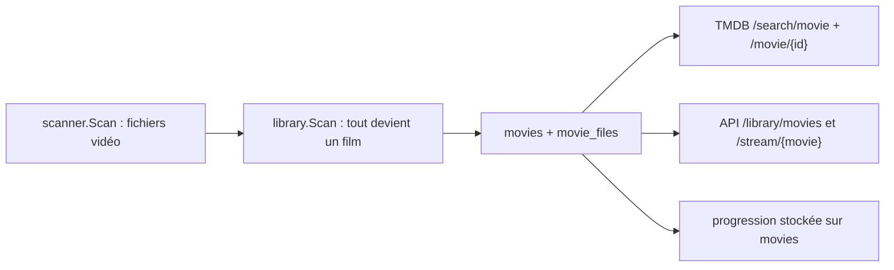

# V2-M3 — Découverte backend séries

> **Mise à jour après implémentation :** le verdict `PARTIAL` du spike est
> dépassé par M3-BE, implémenté dans
> [`5b2615e`](https://github.com/Benitoow/theia-media/commit/5b2615e77655e41567f339e68de3cf7c8e0a05d7)
> et livré par la [PR #5](https://github.com/Benitoow/theia-media/pull/5).
> Le contrat de production est dans `theia-v2-backend.md`. Les sections 1 à 10
> ci-dessous restent l'archive exacte de la découverte menée avant le code —
> elles expliquent les risques et ne doivent plus être lues comme l'état actuel.

**Verdict historique du spike : PARTIAL.** Le chemin technique était viable,
mais la bibliothèque active ne contenait aucune série : le spike avait donc
vérifié l'absence de faux positifs sur les films réels, pas l'import positif
d'une vraie saison.

Ce document décrivait l'état observé le 2 août 2026 depuis `d0aac15`. À cette
date, il ne créait aucun contrat frontend, aucune migration SQLite et aucun
endpoint. Les éléments marqués **proposés** ont depuis été tranchés et leur
résultat est résumé en section 11.

---

## 1. Question testée

> Peut-on ajouter les séries sans réécrire le modèle film livré par M1, tout en
> classant prudemment les fichiers, en gardant un fichier physique comme source
> de vérité et en préparant TMDB TV, la lecture et la progression par épisode ?

Le spike couvre :

- l'inventaire de la bibliothèque active ;
- un parseur jetable `SxxExx` / `1x02` ;
- les frontières avec le scanner, SQLite, TMDB, les routes et la progression ;
- un modèle et un découpage d'implémentation proposés.

Il exclut volontairement :

- toute migration ou modification du backend de production ;
- tout appel réel consommant le quota TMDB ;
- tout frontend ;
- la résurrection anticipée des profils de M2 ;
- les sous-titres, le transcodage vidéo et les apps natives.

---

## 2. Ce qui a réellement été vérifié

### Bibliothèque active

| Mesure | Résultat |
|---|---:|
| Vidéos parcourues | 283 |
| MKV | 201 |
| MP4 | 61 |
| AVI | 19 |
| MOV | 1 |
| TS | 1 |
| Fichiers directement à la racine | 241 |
| Fichiers un niveau sous la racine | 42 |
| Fichiers plus profonds | 0 |
| Motifs `SxxExx` | 0 |
| Motifs `1x02` | 0 |
| Mots `Season`, `Saison`, `Episode`, `Épisode`, `Special`, `OVA` | 0 |
| Dossiers `S01`, `Season 1`, `Saison 1`, `Specials` | 0 |

Conclusion brute : cette bibliothèque est un bon corpus négatif de films et un
mauvais corpus positif de séries. La transformer en “preuve réelle” de support
des épisodes serait simplement faux.

### Parseur jetable

Le spike a exécuté un parseur séparé du code de production avec :

- 9 cas positifs : `S02E03`, `S1E2`, `1x04`, dossier de saison, année de
  remake, saison spéciale `S00`, fichier multi-épisodes compact et séparé,
  titre de série absent explicitement signalé ;
- 13 cas négatifs ou malformés : `Se7en`, `1917`, `Room 104`, une date ISO,
  un motif collé au titre, un suffixe alphanumérique, `Season 1 Episode 2`,
  `101`, `SxxEyy`, saison ou épisode trop longs ;
- 1 000 exécutions identiques du même cas ;
- deux inventaires complets successifs de la bibliothèque active, byte pour
  byte identiques.

Résultat : tous les tests passent et le parseur classe **0 des 283 films** en
épisode. Cela valide la frontière négative du prototype, pas encore sa tenue
sur les conventions réelles d'une collection de séries.

### TMDB TV

La documentation officielle consultée confirme les trois appels nécessaires :

- [`GET /3/search/tv`](https://developer.themoviedb.org/reference/search-tv),
  avec `first_air_date_year` disponible pour distinguer les remakes ;
- [`GET /3/tv/{series_id}`](https://developer.themoviedb.org/reference/tv-series-details),
  avec `append_to_response` ;
- [`GET /3/tv/{series_id}/season/{season_number}`](https://developer.themoviedb.org/reference/tv-season-details),
  qui renvoie le détail d'une saison et de ses épisodes.

Aucun appel authentifié n'a été lancé pendant ce spike. Les routes existent ;
leur comportement avec la clé embarquée de Theia reste à tester en production.

---

## 3. État du backend actuel

Les points observés qui comptent pour M3 :

- `internal/scanner` ignore le domaine média. C'est sain, mais `scanner.File`
  ne transporte ni la racine choisie ni le chemin relatif. Or le dossier parent
  est le seul repli fiable quand un fichier s'appelle seulement `S01E02.mkv`.
- `library.Service.Scan` envoie actuellement chaque vidéo vers
  `ParseFileName`, puis vers `movies`. Le classifieur film/série doit donc être
  placé ici, avant les deux réconciliations.
- `movie_files` référence directement `movies`. Les caractéristiques ffmpeg et
  les pistes audio sont elles aussi film-spécifiques dans SQLite et dans l'API.
- le client TMDB, ses statuts de fraîcheur et son choix de résultat sont écrits
  pour les films, mais le transport HTTP, le rate limiter et les règles de cache
  sont réutilisables.
- `/api/library/home`, les rangées, les statistiques et toutes les routes de
  lecture transportent des `Movie`. Ajouter des séries n'est pas un simple
  endpoint de plus : les réponses mixtes auront besoin d'un discriminant de
  type stable.
- la progression du lecteur est encore stockée sur `movies`. M2 doit la séparer
  par profil, mais son modèle n'est pas défini tant que les références visuelles
  du mainteneur manquent. Figer la progression des épisodes maintenant
  imposerait en douce le modèle M2.
- le scanner saute tout dossier nommé `shorts`. Ce choix était correct pour les
  bonus de films, mais peut cacher une collection de courts épisodes ou un
  dossier de série légitime. M3 doit tester et resserrer cette règle ; elle ne
  peut pas rester globale par habitude.

---

## 4. Contrat de parsing proposé

Le parseur d'épisode reste séparé de `ParseFileName`. Il reçoit le **chemin
relatif à la racine de bibliothèque**, pas le chemin absolu complet.

### Reconnu automatiquement

- `S01E02`, `S1E2` et la casse équivalente ;
- `1x02` ;
- `S01E01E02` et `S01E01-E02`, en conservant la liste complète des numéros ;
- `S00E01` comme saison spéciale ;
- le titre placé avant le marqueur dans le nom du fichier ;
- si ce préfixe est vide, le premier dossier parent qui n'est pas un dossier de
  saison ;
- une année plausible dans le titre de série via le parseur film existant :
  `The.Office.2005.S01E01` devient titre `The Office`, année `2005`.

Le marqueur doit avoir une vraie frontière. `ProjectS01E02`, `CAS01E02X` et
`Show.S01E02X` ne sont pas des épisodes reconnus.

### Non deviné dans la première passe

- `101` ou `102` ;
- `Episode 2` / `Épisode 2` sans saison explicite ;
- numérotation absolue d'anime ;
- épisodes datés `2026-08-02` ;
- ordre DVD, ordre de diffusion alternatif ou groupes d'épisodes TMDB.

Ce refus est volontaire. Un faux négatif produit un problème de scan que l'on
peut corriger ; un faux positif catalogue un film dans la mauvaise famille,
télécharge les mauvaises métadonnées et pollue la progression.

### Sorties du classifieur

Le classifieur ne doit pas renvoyer un booléen paresseux. Il lui faut trois
résultats :

1. `movie` — aucun marqueur d'épisode fiable ;
2. `episode` — série, saison et numéro(s) identifiables ;
3. `ambiguous_episode` — marqueur fiable mais titre de série introuvable.

Le troisième cas produit un code de problème stable dans le rapport de scan.
Il ne doit ni disparaître silencieusement, ni être transformé en film pour faire
monter un compteur flatteur.

---

## 5. Modèle SQLite proposé

### Alternatives écartées pour la première implémentation

| Option | Gain | Coût | Verdict du spike |
|---|---|---|---|
| Migrer films et séries vers un arbre générique `media_items` | Modèle très pur | Réécrit M1, les routes, le streaming et la progression en une fois | Trop risqué |
| Rendre `movie_files` polymorphe avec `movie_id` ou `episode_id` nullable | Moins de tables | Contraintes XOR, cascades et ownership fragiles | À rejeter |
| Ajouter des tables séries parallèles et mutualiser seulement le code Go | Migration additive, films inchangés | Un peu de SQL répété | **Recommandé** |

Le schéma recommandé est additif :

| Table | Rôle et contraintes principales |
|---|---|
| `series` | Identité locale `title + year`, métadonnées TMDB, fraîcheur, dates d'ajout/mise à jour |
| `seasons` | `series_id`, `season_number`, métadonnées de saison, unique sur `(series_id, season_number)` |
| `episodes` | `season_id`, `episode_number`, métadonnées TMDB, unique sur `(season_id, episode_number)` |
| `episode_items` | Un élément local jouable ; `episode_key` canonique (`1` ou `1,2`) unique dans la saison |
| `episode_item_members` | Jointure ordonnée élément jouable ↔ épisode, unique sur `(episode_item_id, episode_id)` |
| `episode_files` | Un fichier physique lié à un `episode_item`, `path` unique, génération de scan et caractéristiques ffmpeg |
| `episode_file_audio_tracks` | Même contrat mesuré que `movie_file_audio_tracks` |

L'élément jouable et sa jointure sont indispensables. Un nom `S01E01E02`
décrit un seul fichier physique et deux épisodes TMDB ; deux encodages du même
double épisode doivent rester un seul élément avec deux fichiers sélectionnables.
Dupliquer le chemin, la sonde ffmpeg et les pistes audio sur chaque épisode
serait une dette instantanée. Les fichiers ne sont regroupés que si leur liste
ordonnée d'épisodes est strictement identique.

La progression n'apparaît pas encore dans ce schéma. Elle doit référencer
`episode_items` — l'élément logique que le lecteur reprend — et le profil M2 qui
regarde. Créer une colonne temporaire sur `episodes`, puis la migrer quelques
jours plus tard, serait du travail jetable dans le produit au lieu d'un spike
jetable à côté.

### Migration proposée, en plusieurs coupes

1. **M3-A — catalogue local** : tables séries additives, classifieur,
   réconciliation et tests de renommage/suppression. Aucun changement aux films.
2. **M3-B — métadonnées et lecture** : TMDB TV, fichiers/pistes mesurés, routes
   série/saison/épisode et streaming. Toujours sans rangée personnelle.
3. **M3-C — expérience personnelle** : seulement après le contrat M2,
   progression par profil, reprise, épisode suivant et accueil mixte.

M3-A peut avancer pendant que le frontend M2 attend ses maquettes. M3-C ne le
peut pas sans inventer le futur modèle de profils.

---

## 6. Réconciliation proposée

1. Le scanner conserve son rôle de marcheur, mais ajoute `Root` et
   `RelativePath` à chaque fichier trouvé.
2. Le service classe chaque fichier avant écriture.
3. Le chemin film continue exactement dans le code M1 existant.
4. Le chemin épisode crée ou retrouve série, saison, épisode(s), élément
   jouable, fichier et jointures dans une transaction.
5. L'association locale d'une série suit la même prudence que M1 : titre
   normalisé + année quand elle existe ; sans année, aucune fusion agressive de
   remakes homonymes ; un `tmdb_id` identique devient ensuite la preuve forte.
6. Un renommage conserve l'identité du fichier avec les mêmes garde-fous que
   M1. Un changement film ↔ épisode retire l'ancienne appartenance dans la même
   transaction afin qu'un chemin ne soit jamais jouable dans les deux familles.
7. La purge ne s'exécute que si le parcours et toutes les écritures ont réussi.
   Elle supprime ensuite les fichiers absents, les épisodes orphelins, les
   saisons vides et enfin les séries vides.
8. TMDB intervient après le catalogue local. Une panne réseau retarde les
   affiches ; elle ne doit jamais rendre les fichiers invisibles.

Tests de production obligatoires : premier scan, second scan idempotent,
renommage, déplacement de saison, suppression, erreur SQLite injectée, racines
qui se chevauchent, changement de classification et conflit TMDB.

---

## 7. Stratégie TMDB proposée

- rechercher la série avec `query`, `language=fr-FR`, `include_adult=false` et
  `first_air_date_year` quand l'année est connue ;
- retenter sans année seulement après un vrai `not_found`, comme pour les films ;
- préférer un nom/original_name exact, puis la popularité ;
- lire le détail de la série une fois ;
- lire uniquement les saisons présentes localement, pas l'intégralité du
  catalogue TMDB ;
- réutiliser les durées de cache actuelles : 90 jours après succès, 7 jours
  après absence ou erreur ;
- garder les métadonnées en `fr-FR`. Le changement de langue de l'interface ne
  relance pas la bibliothèque de films aujourd'hui et ne relancera pas toutes
  les séries demain.

Cette stratégie limite les appels à environ une recherche + un détail par série
et un détail par saison réellement possédée.

---

## 8. API proposée — pas encore un contrat

| Route | Intention |
|---|---|
| `GET /api/library/series` | Catalogue paginé de séries |
| `GET /api/library/series/{id}` | Fiche série et saisons locales |
| `GET /api/library/series/{id}/seasons/{number}` | Épisodes locaux d'une saison |
| `GET /api/library/episodes/{id}` | Fiche d'un élément jouable, un ou plusieurs numéros, fichiers et voisinage |
| `POST /api/library/episodes/{id}/files/{file_id}/inspect` | Sonde explicite d'un fichier de cet élément |
| `GET /api/stream/episodes/{id}/files/{file_id}/info` | Décision direct/remux et durée |
| `GET /api/stream/episodes/{id}/files/{file_id}` | Lecture directe |
| `GET /api/stream/episodes/{id}/files/{file_id}/remux` | Remux et choix de piste audio |

Ici, l'`id` d'épisode désigne l'`episode_item` local et le payload expose
`episode_numbers: [1]` ou `[1, 2]`. Les identifiants TMDB de chaque épisode
restent dans le tableau de métadonnées membre. Les réponses mixtes futures
utiliseront `kind: "movie" | "episode"` ; elles ne tenteront pas de faire
rentrer un épisode dans le JSON `Movie`. Les routes de progression et la forme
de `/api/library/home` restent réservées jusqu'à M2. Comme partout ailleurs, le
serveur renverra des codes stables (`series_not_found`, `episode_not_found`,
`file_not_found`, etc.) et le frontend possédera la prose.

---

## 9. Décisions à prendre avant M3-A/M3-C

Ces points ne sont **pas** inscrits dans `DECISIONS.md` tant que le mainteneur ne
les a pas tranchés.

1. **Ordre des travaux.** Recommandation : lancer M3-A puis M3-B maintenant,
   garder progression/accueil pour M3-C après M2. Alternative : attendre M2 et
   faire M3 d'un bloc.
2. **Fichier multi-épisodes.** Recommandation : une entrée jouable combinée
   « épisodes 1–2 », liée aux deux épisodes TMDB ; l'épisode suivant part après
   le numéro maximal. Alternative : deux cartes qui lancent le même fichier au
   début, comportement techniquement facile mais franchement trompeur.
3. **Spéciaux `S00`.** Recommandation : saison séparée, visible, mais hors de
   l'enchaînement automatique principal. L'ordre chronologique des spéciaux
   demande des règles éditoriales que le nom de fichier ne contient pas.
4. **Trou dans une saison.** Recommandation : « épisode suivant » signifie le
   prochain épisode possédé localement, avec un indicateur de trou ; ne pas
   bloquer la lecture parce que `E04` manque.
5. **Grammaire initiale.** Recommandation : garder uniquement `SxxExx` et
   `1x02`. Les numérotations absolues et datées auront un jalon fondé sur de
   vrais fichiers, pas une regex universelle sortie d'un chapeau.

---

## 10. Condition de sortie du spike

Le verdict passera de `PARTIAL` à `VALIDATED` quand :

- les cinq décisions ci-dessus seront tranchées ;
- un corpus positif réel sera disponible, idéalement avec deux séries, deux
  saisons, un spécial, un fichier multi-épisodes et deux qualités d'un épisode ;
- les renommages, suppressions, erreurs et scans répétés seront joués sur une
  base temporaire copiée depuis la vraie installation ;
- les appels TMDB TV seront vérifiés avec la clé réellement utilisée par Theia ;
- les routes seront testées avec un média décodable, puis lues dans un vrai
  navigateur au port de test `8395`.

Le prochain coup recommandé est donc M3-A, **après validation des décisions 1 à
5 et mise à disposition d'un corpus positif**. Commencer la migration avant ces
deux entrées ne serait pas de l'avance ; ce serait juste coder plus vite dans le
brouillard.

---

## 11. Sortie du spike et état livré

Le mainteneur a ensuite demandé M3 backend en entier. Les cinq choix proposés
ont été retenus :

1. M3-A/B/C livrés ensemble côté serveur ;
2. un fichier multi-épisodes forme un item combiné ;
3. `S00` reste visible et hors autoplay principal ;
4. le prochain épisode est le prochain possédé, avec indicateur de trou ;
5. la grammaire initiale reste `SxxExx` et `1x02`.

Faute de contrat M2, la progression épisode est single-viewer sur
`episode_items`, comme les films actuels. Cette décision est migratable et ne
réintroduit aucune table, entête ou sélection de l'ancien système profils.

M3-BE fournit maintenant la migration `0007_tv_series.sql`, la réconciliation,
TMDB TV, la consolidation, les API catalogue/saison/item, les fichiers et pistes
mesurés, direct/remux, progression, reprise et voisinage. Les décisions 39 à 42
de `DECISIONS.md` en sont la trace d'architecture.

Vérification finale :

- la bibliothèque réelle actuelle compte 274 vidéos, classées en 254 films et
  0 série dans une base isolée — zéro faux positif ;
- le corpus positif séparé a réellement été décodé et contient `S00`, saison 1,
  multi-épisode, deux fichiers et deux pistes audio ;
- TMDB réel a identifié *Severance* et seules les saisons locales ont été lues ;
- Range 206, remux de la piste française, progression, trou, renommage ambigu,
  suppression, scans répétés et changement film ↔ épisode sont couverts ;
- tests, vet et les six cibles sans CGO passent.

La réserve ne change pas de nom pour faire joli : aucune série utilisateur
n'existe encore. Le corpus positif est contrôlé et décodable, pas issu du foyer.
M3-FE doit donc refaire le parcours visuel sur les premiers vrais fichiers
avant que le jalon produit complet soit déclaré terminé.
