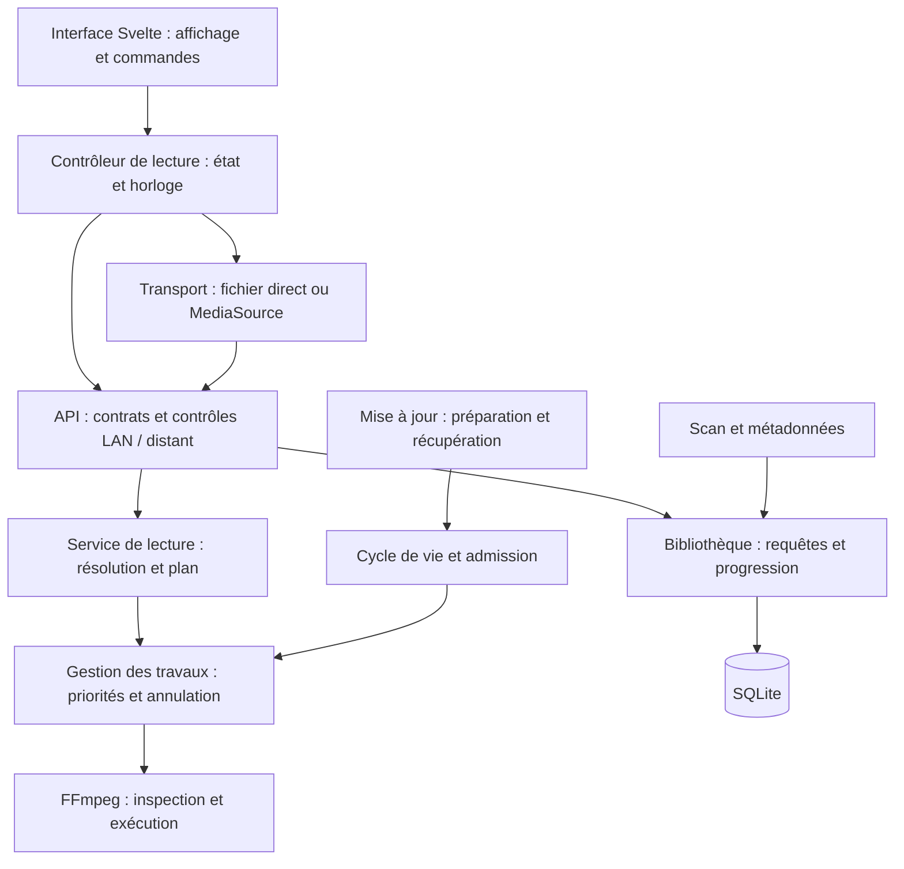

# THEIA - Proposition de modernisation du moteur

Document de travail du 10 septembre 2026. **Plan de référence : certaines
tranches sont réalisées localement, sans autorisation de publication.**

État au 11 septembre 2026 : le **lot 1 est réalisé** - la refonte du backend de
lecture (contrats et filet, plan unique, cycle de vie, adaptateurs, solidité,
matériel mesuré) est terminée dans l'arbre de travail, sans commit, et
consignée dans [`plan-refonte-lecture.md`](plan-refonte-lecture.md) (état
d'avancement) et
[`engine-modernisation-3.2-preview4.md`](engine-modernisation-3.2-preview4.md).
Les autres lots restaient alors proposés.

Complément du même jour, explicitement demandé après la validation sur média
réel : le traitement de la saturation MediaSource d'Edge et la qualification du
runtime FFmpeg 8.1.2-4 sont réalisés. Ils sont consignés dans
[`ffmpeg-8.1.2-validation.md`](ffmpeg-8.1.2-validation.md) et les décisions 109
et 110.

État au 12 septembre 2026 : la preview 5 ferme les travaux expressément retenus
pour rendre la 3.2 publiable dans de bonnes conditions : remplacement sûr d'un
FFmpeg ancien ou manuel, pause libérant les ressources, transport adapté aux
navigateurs, bout-en-bout de l'updater, endurance, découpage ciblé du lecteur,
fichier neuf visible au premier passage et catalogue de plus de 500 séries.
Les preuves et les limites sont réunies dans
[`engine-modernisation-3.2-preview5.md`](engine-modernisation-3.2-preview5.md).
Cela ne transforme pas automatiquement tous les autres items prospectifs des
lots 2 à 6 en travail réalisé.

Le but : une lecture plus fiable, un moteur plus facile à faire évoluer, une empreinte maîtrisée et des mises à jour récupérables. Le périmètre couvre le serveur Go, le lecteur navigateur, FFmpeg, SQLite, le scan, les caches, les accès réseau et la fabrication des releases.

La priorité proposée est la lecture, puis la maintenabilité, puis la réduction de l'empreinte. L'ordre précis des optimisations sera ajusté avec les mesures du lot 0. Aucun pourcentage de gain n'est présenté comme acquis.

**1. Point de départ vérifié**

Inspection de `main` à `84d9ae7`, avec des modifications locales déjà présentes. Les décisions 98–100 décrivent une préversion locale V3.2 : compatibilité expliquée, adaptation de lecture, diagnostics et export de support. Ces travaux font partie de l'état à examiner ; ils ne doivent pas être écrasés, dupliqués ou considérés comme déjà publiés.

| Observation actuelle | Conséquence pour le plan |
|---|---|
| Go 1.26.5 ; SQLite `modernc.org/sqlite` 1.54.0 ; CGO désactivé | La base technique est déjà moderne. Pas de changement de langage ou de base justifié par cette inspection. |
| Lockfile : Svelte 5.56.8, SvelteKit 2.70.3, Vite 6.4.3, TypeScript 6.0.3 | Examiner les versions réellement résolues, leur maintenance et leur compatibilité ; ne pas confondre les plages de `package.json` avec les versions installées. |
| Binaire local existant : 18 164 736 octets, soit 17,32 Mio | Référence indicative, pas résultat d'une reconstruction pendant cet examen. Sa correspondance exacte aux sources locales n'a pas été attestée. |
| `web-dist` existant : 1 111 078 octets, soit 1,06 Mio | Le frontend embarqué représente environ 6,1 % de la taille de ce binaire. Cela ne mesure ni le transfert initial ni la mémoire navigateur. |
| Parmi ces assets : JS 364 527 octets, CSS 93 528, WebP 592 894, polices 52 480 | Mesurer les octets effectivement chargés par route avant d'optimiser le bundle. |
| `Player.svelte` : 1 832 lignes ; `app.css` : 4 350 | Concentration de responsabilités à réduire. Un nombre de lignes n'est pas une preuve de lenteur. |
| MediaSource, annulation, buffer borné en temps, conversion films/épisodes commune, admission lecture/mise à jour existent | Renforcer ces mécanismes ; ne pas proposer leur création comme s'ils manquaient. |
| FFmpeg épinglé à `b6.1.1`, vérifié par SHA-256 ; inspection par parsing de sa sortie texte | L'évolution du runtime et la robustesse de l'inspection sont un chantier distinct de la mise à jour de Go. |
| Le limiteur de transcodage et la file des aperçus ont des budgets séparés | Une priorité globale donnée à la lecture mérite d'être mesurée et organisée. |
| SQLite utilise WAL, un délai de verrouillage et des migrations transactionnelles | Ces protections existent. Le dimensionnement des connexions et la récupération après migration restent à qualifier. |
| Les listes de films décodent des champs de détail avant de les retirer ; la recherche normalise des candidats à chaque requête | Optimisations possibles des allocations et des requêtes, à confirmer par profilage. |
| Le navigateur charge tous les films par pages de 500 ; la page séries ne demande qu'une page de 500 | Tester les gros catalogues et la complétude des séries. L'impact sur une bibliothèque réelle n'a pas été mesuré ici. |
| L'updater vérifie le SHA-256, exécute `-version`, échange les fichiers et conserve `.old` | Un contrôle de santé après redémarrage et une récupération cohérente des données ne sont pas encore intégrés à ce parcours. |
| Le workflow de validation construit le frontend, puis chaque cible de la matrice le reconstruit | Candidat concret pour accélérer la CI : partager un même artifact frontend vérifié. |

Vérifications effectuées pour préparer ce plan : `go test ./...` passe, avec une majorité de résultats en cache ; les 34 tests unitaires JavaScript passent. Lecture des documents gouvernants, des chemins critiques et des workflows. Aucun benchmark Go `func Benchmark...`, profilage pprof ou budget de performance automatisé identifié dans les périmètres inspectés.

**Limites de cet examen :** pas de reconstruction du binaire, de lancement de THEIA, de lecture du film réel, de mesure CPU/GPU/RAM, de test physique TV ou de validation distante. Les chiffres de lecture de `docs/v3.md` sont des résultats historiques documentés, pas des mesures renouvelées ici. Les goulets d'étranglement ci-dessus sont des candidats d'optimisation, pas des ralentissements reproduits.

**2. Architecture visée**

Conserver un seul binaire et des modules aux responsabilités nettes. Faire évoluer les frontières déjà présentes avant de déplacer des fichiers.

Le contrôleur de lecture possède les états, la position et les décisions de récupération. Le transport possède les requêtes et le buffer. L'interface présente ces états et transmet les commandes. Le service serveur décide du traitement média ; les handlers HTTP ne reconstruisent pas chacun cette politique.

Films et épisodes partagent les règles de lecture, **mais gardent leurs identités et tables distinctes**, conformément à la décision 39. Les adaptateurs conservent les routes existantes pendant la transition. Les interfaces Go sont petites et définies là où elles sont consommées ; pas de framework d'injection ni de bus universel pour relier quelques fonctions.

**3. Lot 0 - Établir une référence reproductible**

Travail préalable à toute optimisation :

- Figurer exactement les sources mesurées : commit, différences locales, hash du binaire, versions Go/frontend/FFmpeg, paramètres de compilation et matériel. Préserver les travaux de préversion présents.
- Préparer une instance isolée sur le port 8395, avec un répertoire jetable et une copie cohérente des données. Le port 8383 et la bibliothèque personnelle restent hors des écritures de test.
- Constituer deux corpus : catalogues synthétiques de 250, 2 500 et 10 000 entrées pour la charge ; médias jouables pour la lecture. Le bench visuel existant ne remplace pas un corpus vidéo.
- Couvrir MP4 H.264/AAC, MKV avec audio AAC et AC3/DTS/TrueHD, HEVC 10 bits HDR, fichiers sans audio, plusieurs pistes et sous-titres texte, épisodes combinés, sources variables ou endommagées. Utiliser les fichiers réels disponibles et identifier précisément les trous de couverture.
- Mesurer séparément premier usage sans FFmpeg, démarrage à froid avec FFmpeg installé, puis cas chaud. Distinguer lancement du serveur, premier octet, première image effectivement présentée et reprise après seek.
- Relever médiane et p95 des latences, taux et durée des blocages, images présentées/perdues, décalage audio/vidéo, mémoire de Go, mémoire des processus FFmpeg et mémoire navigateur. Ajouter CPU/GPU, nombre de processus, E/S disque et volumes réseau.
- Mesurer stockage installé : binaire, ancien binaire de secours, FFmpeg, SQLite/WAL, images, aperçus, temporaires et logs. Ne jamais additionner ces postes sous l'étiquette « taille du moteur » sans les détailler.
- Profiler les chemins Go avec pprof/trace dans un environnement de développement local. Aucun endpoint de profilage exposé sur le LAN ou WireGuard. Ces outils permettent d'attribuer temps CPU, allocations et contention ; ils ne mesurent pas le travail du processus FFmpeg. [Documentation Go](https://go.dev/doc/diagnostics.html).

Livrable : un rapport de référence, les scripts de reproduction, le corpus décrit et les trois problèmes au meilleur rapport impact/coût. Un résultat est classé confirmé, probable ou non vérifié.

**4. Lot 1 - Consolider les contrats et le filet de sécurité**

- Formaliser les contrats du plan de lecture, des erreurs, de l'identité média, des pistes, du temps demandé et du temps réellement atteint. Le serveur fournit des codes ; le frontend garde les textes FR/EN.
- Renforcer progressivement le typage des modules critiques aujourd'hui en JavaScript vérifié mais non strict : types JSDoc ou TypeScript ciblé. Une migration complète de chaque composant ne constitue pas un objectif.
- Ajouter des scénarios comportementaux manquants : seeks rapprochés, remplacement pendant la préparation, annulation pendant une sonde, deux lecteurs concurrents, pause longue, fin de fichier, échec après les premiers octets, fermeture répétée et changement de profil.
- Étendre les tests du transport au cycle MediaSource complet : initialisation fragmentée, erreurs d'append, saturation du buffer, lecteur lent, abandon et libération des ressources. Les tests unitaires actuels de ce module couvrent surtout la détection des codecs.
- Garder les tests jouables existants et les protections LAN/Origin/Host, l'allowlist distante, la progression et les migrations. Les écrans vides seuls ne suffisent pas.

Livrable : contrats explicites et scénarios qui détectent les régressions avant l'extraction. Le build de distribution reste sans CGO. Un éventuel job utilisant le détecteur de races Go nécessite de clarifier ses prérequis de développement et la règle du projet ; il n'est pas présenté comme vérifié ou comme une commande fonctionnant avec CGO désactivé.

**5. Lot 2 - Séparer le lecteur et fiabiliser son transport**

Découper dans l'ordre suivant : contrôleur de lecture, transport, horloge/progression, sous-titres, contrôles et dialogues. Réutiliser les extractions existantes (`media-transport`, `subtitle-layout`, `track-labels`, adaptation, diagnostics et aperçu).

Le contrôleur décrit explicitement les transitions préparation → prêt → lecture/pause → buffering/recherche → terminé/erreur. Une génération de session invalide les retours asynchrones obsolètes. Une annulation volontaire ne devient pas une erreur utilisateur.

Un seul endroit calcule la relation entre position absolue du film, temps du média et image-clé de départ. Un seek dans une plage réellement réutilisable conserve le flux ; un seek extérieur annule et remplace proprement le traitement. Audio, sous-titres et progression suivent la même référence.

Optimiser le buffer avec une limite en secondes **et** en octets, une gestion explicite de la saturation et une éviction arrière contrôlée. Évaluer des lots d'append limités aussi par le temps d'attente : attendre 1 Mio peut avoir un coût très différent selon le débit. Calibrer la réserve initiale avec les mesures ; les six secondes de la préversion sont une référence à tester, pas une constante sacrée.

Éviter les téléchargements et allocations du lecteur sur les pages qui n'en ont pas besoin lorsque le graphe de bundle le justifie. Toute extraction préserve focus, D-pad, commandes, pistes et i18n. La baisse du nombre de lignes de `Player.svelte` indique une séparation ; elle ne sert pas de preuve de performance.

Acceptation : anciennes fonctions conservées, aucun callback d'une ancienne session ne modifie la nouvelle, aucun flux dupliqué involontaire, ressources rendues après fermeture, tests jouables et corpus réel validés.

**6. Lot 3 - Donner la priorité au film en cours**

Introduire une gestion commune des travaux coûteux : lecture/remux/transcode, inspection, recherche d'image-clé, extraction de sous-titres et génération d'aperçus. Un service léger suffit ; aucune infrastructure externe.

- Priorité à la lecture active et à sa reprise, puis aux actions explicites, enfin aux travaux de confort.
- Admission atomique, limites par type de coût CPU/GPU/E/S, files bornées et attente annulable. Conserver un refus explicable lorsqu'une lecture supplémentaire dépasse les ressources.
- Ne pas confondre encodeur matériel et pipeline peu coûteux : un tone mapping CPU peut saturer la machine malgré un encodeur GPU.
- Dédupliquer les inspections d'un même fichier/version. Une requête annulée ne doit pas graver un échec de capacité pour toute la durée du processus.
- Arrêter et attendre les processus au remplacement ou à la fermeture du serveur. Borner stderr et les diagnostics en mémoire, pas seulement la quantité finalement écrite dans le log.
- Les aperçus disposent déjà d'un timeout et d'un slot entre eux. Les relier au budget de lecture, puis mesurer leur incidence ; l'actuel slot indépendant ne garantit pas cette priorité.

Acceptation : avec un film en lecture, les travaux de fond respectent les budgets retenus. Une saturation n'engendre ni processus orphelins, ni file infinie, ni effondrement de toutes les lectures.

**7. Lot 4 - Moderniser FFmpeg et le traitement vidéo**

Séparer le gestionnaire de runtime, l'inspection, la détection des capacités, la construction des arguments et l'exécution. Cela rend un changement de version testable sans modifier partout les handlers.

Créer un manifeste de runtime maintenu avec THEIA : version, provenance GitHub Releases, architecture, digest, capacités indispensables et version du format des mesures mises en cache. Conserver le téléchargement au premier besoin et l'absence d'installation manuelle. Un changement de runtime est préparé à côté de l'ancien et validé avant activation, avec récupération possible.

Choisir la version de remplacement après vérification des builds réellement disponibles sur les six cibles, des filtres/encodeurs, de la redistribution et du corpus de compatibilité. Un numéro FFmpeg plus récent ne prouve ni la couverture ni la performance. Le repli Windows ARM64 vers x64 est explicite aujourd'hui ; ne pas le faire passer pour un runtime ARM64 natif.

Conserver une interface d'inspection stable. En première étape, isoler le parsing de texte actuel, ses échantillons réels et ses erreurs. L'option ffprobe est soumise à validation distincte plus bas.

Qualifier les pipelines sur leur résultat complet : décodage, mise à l'échelle, couleurs, encodage et livraison. La sonde H.264 synthétique actuelle ne suffit pas à choisir un traitement HEVC 10 bits HDR. Conserver des résultats par famille de média et version du runtime, avec invalidation appropriée ; ne pas multiplier des benchmarks coûteux au premier lancement.

Prototyper les chemins GPU disponibles sur les machines cibles, notamment la réduction des copies CPU/GPU et le tone mapping lorsqu'ils sont réellement pris en charge. Garder le chemin CPU comme repli. FFmpeg documente que les copies entre mémoire GPU et mémoire système peuvent annuler le bénéfice de l'accélération ; le choix doit donc porter sur le pipeline mesuré. [Documentation FFmpeg](https://ffmpeg.org/ffmpeg.html).

Acceptation : tests de lancement, audio, couleurs, seek, sous-titres et reprise sur chaque runtime retenu. À qualité et matériel comparables, les gains sont mesurés. Aucun débit amélioré grâce à une baisse silencieuse de qualité n'est comptabilisé comme optimisation équivalente.

**8. Lot 5 - Optimiser bibliothèque, recherche et scan**

- Mesurer les plans SQL et les allocations. Si leur coût est significatif, introduire des projections dédiées aux listes qui ne décodent plus cast/crew pour les jeter ensuite. Documenter ce qui supersède la décision 85 et protéger l'ordre des colonnes par des contrats/tests ou une génération de code évaluée séparément.
- Examiner les connexions SQLite, les transactions longues et les écritures concurrentes. Définir un petit pool de lectures et une discipline d'écriture selon les résultats ; ne pas imposer une connexion unique sans analyser les requêtes imbriquées.
- Pré-calculer la clé de recherche normalisée lors de l'indexation si le profilage le justifie. Garder les correspondances actuelles, accents et ligatures. Un index B-tree ordinaire ne rend pas une recherche de sous-chaîne `%terme%` instantanée ; un moteur FTS modifierait potentiellement la sémantique et doit être comparé avant adoption.
- Passer au chargement progressif, au tri et aux filtres serveur là où le téléchargement de tout le catalogue coûte trop cher. Préserver l'instantanéité des petites bibliothèques, la totalité des résultats, le retour arrière et la navigation D-pad. Tester explicitement plus de 500 séries.
- Réduire les parcours ou écritures redondants du scanner en partageant les observations lorsque cela reste correct. Conserver une réconciliation complète de secours, les générations de scan, la détection de fichiers encore copiés et l'interdiction de purger après une lecture de disque en erreur.
- Garder le polling compatible USB/SMB. Les notifications natives peuvent être un accélérateur futur, jamais l'unique source de vérité. Le coût réseau et le réveil des disques font partie du benchmark.
- Vérifier la mise en cache des métadonnées, la limitation TMDB, les tentatives après panne et les travaux en double. Conserver les corrections manuelles et la progression de chaque profil lors des déplacements ou consolidations.

Acceptation : catalogue complet aux trois tailles de test, comportement de recherche préservé, aucune perte lors d'un débranchement ou d'une copie incomplète, résultats avant/après sur SSD et sur stockage externe/réseau disponible.

**9. Lot 6 - Réduire l'empreinte et accélérer la fabrication**

Traiter quatre budgets indépendants : téléchargement de THEIA, installation complète, mémoire en fonctionnement et travail de développement/CI.

Analyser la composition réelle du binaire et de ses dépendances avant de retirer un composant. Les options `-trimpath -s -w` sont déjà présentes. Examiner le poids de SQLite et du réseau embarqué sans supposer qu'une dépendance plus petite serait compatible ou plus rapide.

Évaluer le chargement des chunks frontend, les imports inutiles, les styles inactifs et la compression des réponses statiques. Comparer la précompression au build à son coût disque : embarquer une copie compressée supplémentaire peut augmenter le binaire. Le découpage CSS facilite la maintenance mais ne réduit pas automatiquement les octets livrés. Le site public reste pris en compte lorsqu'une dépendance de police semble inutilisée dans l'app.

Recenser les images et aperçus obsolètes, les temporaires abandonnés et les anciennes versions. Proposer un budget de cache et une rétention qui respectent l'usage hors ligne. **La suppression automatique de caches et son plafond demandent une validation avant activation.** Aucun média ni historique ne sert de variable d'ajustement. Les logs de la préversion sont déjà tournants : réutiliser ce travail.

Compiler et vérifier le frontend une fois, puis transmettre exactement cet artifact aux builds des six plateformes. Conserver les vérifications de provenance, de version et les contrôles d'assets. Aligner les versions de développement et de CI ; distinguer le build quotidien incrémental du build de release reproductible.

Ajouter des propositions de mises à jour de dépendances regroupées et testées, sans fusion ou publication automatique implicite. Couvrir Go, npm, actions de CI et runtime FFmpeg. Ajouter un contrôle des vulnérabilités réellement applicables avec `govulncheck`, plus les contrôles appropriés du frontend. Cet outil utilise notamment les appels du programme pour qualifier les dépendances affectées. [Documentation Go](https://go.dev/doc/security/vuln/).

Le PGO reste un essai tardif, une fois l'architecture stabilisée et les profils représentatifs disponibles. Comparer performances **et** taille du résultat ; ne pas appliquer au projet les pourcentages génériques annoncés ailleurs. Il optimise Go et ne rend pas directement FFmpeg plus rapide. [Documentation PGO](https://go.dev/doc/pgo).

Acceptation : bilan par poste et par cible ; aucune suppression de capacité dissimulée dans le gain ; même bundle vérifié pour les six distributions ; durée de CI et taille des artifacts comparées.

**10. Lot 7 - Rendre les mises à jour récupérables de bout en bout**

Étendre l'updater actuel plutôt que remplacer son mécanisme éprouvé.

Parcours cible : découverte de version → téléchargement vérifié → précontrôle → admission exclusive et arrêt coordonné des écritures/travaux concernés → sauvegarde cohérente → remplacement → migration → vérification de santé → validation durable de l'installation.

- Conserver l'action explicite d'installation et la protection contre l'interruption d'une lecture.
- Vérifier l'espace nécessaire au staging et au secours ; tester refus d'accès, fichier verrouillé, téléchargement incomplet, mauvais hash, erreur de migration et crash au redémarrage.
- Associer chaque point de récupération au binaire, à la version du schéma et à la configuration correspondants. Garder les secrets locaux hors des artifacts de CI et des rapports de performance.
- Utiliser une sauvegarde SQLite cohérente avec WAL, pas la copie isolée d'un `.db` actif. Examiner l'API de sauvegarde accessible via le driver ou `VACUUM INTO`, sans ajouter de dépendance C au produit. [Techniques de sauvegarde SQLite](https://sqlite.org/backup.html).
- Ajouter un journal de mise à jour durable : après interruption du processus ou de la machine, le prochain lancement sait reprendre ou revenir à un état cohérent.
- Définir un contrôle de santé avec la version attendue, l'accès DB et une requête de catalogue ; un `-version` réussi ne couvre pas le démarrage du service.
- Conserver les migrations compatibles avec la version précédente pendant la fenêtre de secours. Retarder les suppressions de colonnes/routes. Tester N → N+1 → N avec la progression de tous les profils.
- Distinguer récupération d'un démarrage raté et retour volontaire plusieurs jours après. Restaurer un vieux snapshot après de nouvelles écritures ferait perdre les nouveaux visionnages : le plan doit l'empêcher ou annoncer précisément cette conséquence avant toute action.

Le protocole de récupération doit rester réalisable avec le modèle du binaire unique. Ne pas ajouter par défaut un service superviseur obligatoire. Si un petit mode de supervision temporaire du même exécutable s'avère nécessaire, documenter et tester son cycle de vie avant adoption.

Acceptation : installations volontairement interrompues récupérables, version attendue effectivement servie, médias et historique intacts, cas Windows réellement exécutés et limites des autres plateformes clairement rapportées.

**11. Ordre de livraison et critères de sortie**

Ordre recommandé : **0 → 1 → 2 → 3 → 4 → 5 → 6 → 7**, puis qualification complète. Le contrat de sauvegarde et de migration du lot 7 est défini dès le lot 1 et mis en place avant toute migration incompatible ou distribution de la refonte. Les améliorations de CI sans dépendance aux autres lots peuvent avancer plus tôt, sans regrouper des changements non liés dans une même livraison.

| Porte de sortie | Proposition de critère |
|---|---|
| Correction | Pas de régression connue de lecture, profils, reprise, choix de fichier/piste, sous-titres, accès distant ou parcours TV. |
| Gain | Hypothèse écrite avant le changement ; mesures répétées sur même matériel/corpus. Un gain inférieur au bruit n'est pas revendiqué. |
| Lecture durable | Au moins 30 minutes sur chaque chemin représentatif, un film difficile complet avant publication, seeks proches/lointains et changements de pistes. Sur matériel capable et réseau contrôlé : aucune interruption imputable au moteur. |
| Audio/vidéo | Référence mesurable avec mire/impulsions pour les fixtures, puis observation réelle. Le décalage après seek ne dépasse pas celui de la source au-delà de la tolérance explicitement fixée au lot 0. |
| Ressources | 100 cycles ouverture/seek/fermeture : pas de croissance continue de mémoire ou de processus. Comptabiliser séparément Go, FFmpeg et navigateur. |
| Catalogue | Réponses complètes et budgets de latence respectés à 250/2 500/10 000 entrées ; limites lentes expliquées. |
| Mise à jour | Reprise après chaque étape interrompue et essai de retour arrière cohérent avec les données. |
| Plateformes | Six builds CGO=0. Essais natifs Windows, Linux et macOS puis ARM64 selon matériel disponible ; une compilation croisée ne vaut pas validation matérielle. |
| Navigateurs et réseau | Chromium, Firefox et Safari/navigateur TV selon disponibilité ; vrai second appareil et vrai accès extérieur pour qualifier le distant. |

À la fin du lot 0, fixer les objectifs chiffrés réalistes pour les trois coûts dominants, avec un budget de non-régression. À titre d'ambition, chercher des améliorations de plusieurs dizaines de pour cent sur les goulets mesurés ; ne pas promettre de diviser par deux un binaire déjà compact ni de rendre une machine incapable de transcoder magiquement temps réel.

Chaque lot livre une petite tranche utilisable, les mesures comparatives, les limites et un chemin de retour. Les déplacements de code, les changements de comportement et les migrations restent lisibles séparément. Les correctifs de stabilité nécessaires peuvent suivre la ligne publique V3.1 selon son périmètre ; la refonte continue localement jusqu'à décision explicite sur sa distribution.

L'effort doit être estimé après le lot 0. Les inconnues principales sont la couverture matérielle, les pipelines HDR, les runtimes FFmpeg par plateforme et la récupération des mises à jour. Donner aujourd'hui une date ferme masquerait précisément ces inconnues.

**12. Propositions supplémentaires - validation séparée avant intégration**

Ces options restent en dehors du socle retenu par défaut. Les présenter avec un prototype ou une comparaison suffisante avant de demander une décision finale.

| Option | Intérêt | Coût ou arbitrage | Recommandation |
|---|---|---|---|
| Ajouter ffprobe au runtime autogéré | Inspection structurée JSON, moins dépendante de messages texte | Deuxième exécutable, poids et distribution à vérifier ; modifie l'interprétation de « FFmpeg seul » et la décision 16 | Première option à étudier. ffprobe fournit officiellement des sections et writers structurés. [Documentation](https://ffmpeg.org/ffprobe.html). |
| Distribuer notre propre build FFmpeg ciblé | Contrôle des mises à jour, réduction potentielle du poids, couverture exacte | Maintenance de six cibles, codecs et filtres à conserver, provenance et obligations de redistribution | Étude seulement après mesure du runtime existant. |
| Ajouter un transport HLS pour des clients identifiés | Peut améliorer certains cas Safari/TV et la reprise réseau | Segmentation, stockage temporaire et deuxième transport à maintenir | Seulement devant un échec client reproduit que le transport actuel ne résout pas correctement. |
| Proposer des versions préconverties des médias | Lecture moins coûteuse sur petit serveur ou client limité | Consomme du disque et du temps en amont ; demande une politique de création/suppression visible | Fonction produit distincte, jamais activée en silence. |
| Proposer des éditions distinctes ou du réseau distant téléchargeable séparément | Peut alléger les installations sans accès distant | Complique le binaire unique, l'installation, le support et l'updater | Déconseillé tant que le poids réel de WireGuard/gVisor n'est pas attribué et que le gain ne le justifie pas. |

Les plafonds et la purge automatique des caches du lot 6 sont aussi une décision explicite, car ils affectent l'usage hors ligne. Les changements de qualité automatique supplémentaires au-delà de la préversion doivent être montrés et validés lorsqu'ils modifient le rendu ou le choix du spectateur.

La refonte ne crée par défaut ni comptes cloud, ni télémétrie, ni nouvelle interface visuelle, ni dépendance runtime additionnelle. Les contraintes techniques et l'identité V3.1 restent les références. Tout écart accepté se documente avant son implémentation, dans la même livraison.

**13. Points d'entrée pour exécuter le plan**

| Domaine | Sources actuelles à relire au démarrage du lot |
|---|---|
| Contrat produit | `CLAUDE.md`, `docs/spec-fondatrice.md`, `docs/DECISIONS.md`, `docs/design-system.md`, `docs/v3.md` |
| Démarrage, arrêt, admission | `cmd/theia/main.go`, `internal/activity/activity.go` |
| HTTP et lecture | `internal/api/server.go`, `converted_stream.go`, `transcode.go`, `movie_file_stream.go`, `episode_stream.go`, `internal/stream/stream.go` |
| Runtime média | `internal/ffmpeg/ffmpeg.go`, `capabilities.go`, `decoders.go`, `seek.go`, `internal/preview/preview.go`, `internal/subtitles/subtitles.go` |
| Lecteur | `web/src/lib/components/Player.svelte`, `web/src/lib/media-transport.js`, `playback-adaptation.js`, `playback-compatibility.js`, `subtitle-layout.js` |
| Bibliothèque | `internal/db/db.go`, `internal/library/browse.go`, `search.go`, `sync.go`, `watch.go`, réconciliation films/épisodes |
| Caches et diagnostics | `internal/imagecache/imagecache.go`, `internal/supportlog`, `internal/api/support_report.go`, `web/src/lib/diagnostic-events.js` |
| Mise à jour | `internal/updater/apply.go`, `updater.go`, `github.go`, tests d'activité pendant téléchargement |
| Distribution et validation | `build.ps1`, `.github/workflows/validate.yml`, `ci.yml`, `release.yml`, `web/tests/playback.spec.js`, `web/tests/layout.spec.js`, `web/tests/unit/` |

La première tranche à autoriser est le lot 0 : obtenir les mesures qui permettront de choisir les optimisations, sans engager encore les options supplémentaires ou la publication.
