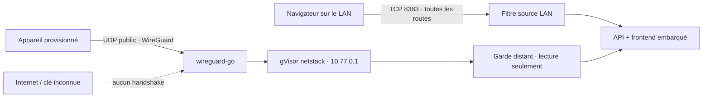

# V2-M4 — Découverte backend accès distant

**Verdict du spike : `VALIDATED`.** Theia peut embarquer un serveur WireGuard
et une pile IP entièrement en Go, sans interface réseau système, sans CGO, sans
compte cloud et sans nouveau processus. Deux pairs jetables ont réellement
échangé des requêtes HTTP ; un pair inconnu puis un pair révoqué ont été
refusés ; les six cibles de compilation ont produit un binaire.

Ce document fige la menace et le choix technique qui précèdent M4-BE. Le
contrat de production et le handoff frontend vivent dans
`theia-v2-backend.md`. Rien ici ne promet de traverser magiquement un CGNAT : un
VPN qui prétend abolir les routeurs finit généralement par cacher un cloud sous
le tapis.

---

## 1. Question testée

> Peut-on rendre la bibliothèque joignable hors du domicile sans exposer le
> serveur HTTP zéro-authentification, sans introduire de compte, de relais ou de
> dépendance d'installation, et sans casser le binaire CGO-free sur les six
> plateformes ?

M4 doit permettre à un appareil explicitement provisionné de consulter et lire
la bibliothèque. Il ne doit pas lui donner les commandes d'administration du
serveur. Le LAN reste le chemin de récupération si le tunnel est mal configuré.

Hors question :

- découverte automatique de l'adresse publique, UPnP et ouverture du routeur ;
- relais pour CGNAT, NAT traversal, STUN/TURN ou compte de contrôle ;
- HTTPS public, domaine, certificat ACME ou reverse proxy ;
- mot de passe, compte utilisateur, profil ou permission par personne ;
- interface Svelte de M4, laissée à M4-FE.

## 2. Menace retenue

### Acteurs autorisés

- toute machine du réseau local de confiance conserve le modèle v1 sans login ;
- un appareil distant n'entre qu'avec une clé privée WireGuard créée depuis le
  LAN ;
- chaque appareil a sa propre identité, adresse `/32` et révocation.

### Adversaires couverts

- un scanner internet ou un paquet UDP invalide ne reçoit aucune API HTTP ;
- une clé inconnue ou révoquée ne peut pas établir le tunnel ;
- un pair valide ne peut pas lire les réglages, scanner, terminer l'onboarding,
  installer une mise à jour ou administrer d'autres pairs ;
- les en-têtes proxy envoyés par le client ne transforment pas une adresse
  publique en adresse LAN ;
- un rebinding DNS, une iframe ou une sous-ressource cross-site ne peut pas
  contourner l'hôte fixe et la politique d'origine du listener distant ;
- aucun chemin absolu, clé privée serveur ou clé privée d'un autre client ne
  traverse l'API.

### Limites assumées

- le propriétaire configure lui-même une redirection **UDP** ou un endpoint
  équivalent ; M4 ne sait pas franchir un CGNAT sans infrastructure tierce ;
- le port TCP historique ne doit jamais être publié. Le filtre d'adresse ajoute
  une ceinture, pas une excuse pour tester le parachute depuis internet : un
  reverse proxy local ou certains routeurs qui réécrivent la source peuvent
  rendre l'appel local aux yeux de Theia ;
- une personne déjà admise sur le LAN peut créer un appareil distant. C'est la
  conséquence directe du modèle de confiance zéro-login, pas une permission
  cachée ;
- la compromission de la machine serveur, du compte système ou de la clé privée
  d'un appareil reste hors de portée du protocole ; il faut révoquer l'appareil
  concerné.

## 3. Options examinées

| Option | Avantage | Incompatibilité | Verdict |
|---|---|---|---|
| Exposer HTTP/HTTPS avec mot de passe | Familier dans un navigateur | Nouveau système d'identité, secrets, récupération, TLS et surface publique | Rejeté |
| Embarquer `tsnet` | NAT traversal et DNS très confortables | Connexion à un tailnet et à son control plane, compte/cloud et nouveaux appels sortants | Rejeté |
| Exiger Tailscale/WireGuard installé sur l'hôte | Peu de code dans Theia | Brise le binaire autonome et impose installation/privilèges système | Rejeté |
| WireGuard userspace + netstack embarqués | Clés par appareil, UDP silencieux, aucun TUN système, pur Go | Redirection UDP manuelle et pas de relais CGNAT | **Retenu** |

Les documents officiels WireGuard confirment l'existence d'une
[implémentation userspace multiplateforme](https://www.wireguard.com/xplatform/)
et décrivent explicitement les chemins
[d'intégration dans une application](https://www.wireguard.com/embedding/).
L'API `CreateNetTUN` utilisée par le spike vient du
[module officiel `wireguard-go`](https://git.zx2c4.com/wireguard-go/tree/tun/netstack/tun.go).
`tsnet` est bien un serveur embarqué, mais sa
[documentation officielle](https://tailscale.com/docs/features/tsnet) demande
l'adhésion à un tailnet : excellente technologie, mauvais contrat pour Theia.

Licences vérifiées dans les modules réellement résolus : `wireguard-go` et
`wgctrl` sont MIT ; gVisor est Apache-2.0. Elles sont compatibles avec la
distribution GPL-3.0 de Theia.

## 4. Architecture retenue



Il existe deux listeners et un seul handler applicatif :

1. le listener TCP historique accepte les sources privées, loopback,
   link-local et les préfixes réellement attachés aux interfaces ;
2. le listener HTTP interne à WireGuard accepte seulement l'adresse `/32` d'un
   pair actif, l'hôte exact `10.77.0.1:<port>` et une allowlist de capacités.

HTTP n'est pas chiffré une deuxième fois à l'intérieur : ses octets passent
déjà dans le tunnel WireGuard. Ajouter un certificat auto-signé ne créerait pas
une nouvelle frontière de confiance ; cela créerait surtout un écran d'alerte à
trois mètres.

Le client route uniquement `10.77.0.1/32`. Theia ne devient pas la passerelle
internet de l'appareil, même par accident. Le préfixe fixe `10.77.0.0/24` vit
dans la netstack du processus et ne crée aucune route ni interface dans l'OS.

## 5. Identités et secrets

- La clé privée serveur est créée au premier enable, jamais en migration.
- Sous Windows elle est protégée par DPAPI pour le compte système courant ;
  sous Linux/macOS elle est encodée dans un fichier propriétaire `0600`.
- SQLite conserve uniquement la clé **publique**, le nom et l'adresse du pair.
- La clé privée client existe dans une seule réponse de provisioning et dans
  son QR. Elle n'est ni persistée ni relue par Theia.
- Perdre ce premier affichage signifie révoquer puis créer une nouvelle
  identité. Réafficher une clé que le serveur ne possède pas serait un tour de
  magie, donc probablement un bug.
- Déplacer un data-dir Windows vers un autre compte ou une autre machine rend
  la clé DPAPI illisible. Le serveur LAN continue de démarrer ; l'administrateur
  désactive M4, retire la clé locale et reprovisionne les appareils.

La limite est fixée à 32 appareils actifs. Une révocation enlève immédiatement
la clé de WireGuard et rend son adresse réutilisable, mais conserve la ligne
historique révoquée en base.

## 6. Capacités distantes

Autorisé après handshake :

- frontend statique, santé et contexte de session ;
- lecture du catalogue films/séries, images et flux ;
- inspection explicite d'un fichier ;
- écriture et remise à zéro de la progression.

Toujours local :

- réglages et dossiers de bibliothèque ;
- scan ;
- onboarding et adresses LAN ;
- vérification/application des mises à jour ;
- activation du tunnel, création et révocation d'appareils.

Les écritures distantes exigent la même origine quand un navigateur fournit
`Origin`/`Sec-Fetch-*`. Les réponses refusent l'iframe et les ressources
cross-origin. Un client WireGuard natif sans en-têtes de navigateur reste
compatible.

## 7. Endpoint, portée et récupération

`listen_port` est le port UDP local. `endpoint` est le `hôte:port` public écrit
dans les **nouvelles** configurations ; Theia ne le contacte et ne le découvre
jamais. Le port public peut donc différer après traduction par le routeur.

Un changement d'endpoint ne coupe pas une lecture en cours, mais les clients
déjà créés gardent leur ancienne configuration : il faut modifier leur endpoint
dans WireGuard ou les révoquer/reprovisionner. Un changement de port redémarre
le listener. Si le nouveau port échoue, Theia tente de restaurer l'ancien ; si
cela échoue aussi, le tunnel reste fermé et le LAN reste disponible.

`reachability: "confirmed"` signifie qu'un pair actif a réellement terminé un
handshake depuis le démarrage. Avant cela, `unverified` est honnête : le serveur
ne possède aucune sonde extérieure et ne prétend pas savoir ce que le routeur
fera.

## 8. Spike jetable exécuté

Environnement : Windows, Go 1.26.5, `wireguard-go`
`v0.0.0-20260522210424-ecfc5a8d5446`, deux netstacks en mémoire et un vrai
listener UDP loopback.

Deux exécutions consécutives ont produit :

```text
PASS happy_path
PASS unknown_peer_rejected
PASS revoked_peer_rejected
PASS repeat_after_readd
```

Chaque exécution a duré environ 2,43 s. Réajouter immédiatement la même clé
publique a montré qu'une session client encore vivante peut retarder la reprise ;
créer une nouvelle identité après révocation a fonctionné immédiatement. Le
contrat de production impose donc la révocation puis une clé neuve.

Six cross-builds avec `CGO_ENABLED=0` ont réussi :

| Cible | Taille du spike |
|---|---:|
| Windows amd64 | 14 265 856 octets |
| Windows arm64 | 13 219 328 octets |
| Linux amd64 | 14 057 814 octets |
| Linux arm64 | 13 197 674 octets |
| macOS amd64 | 14 165 104 octets |
| macOS arm64 | 13 364 994 octets |

Ces tailles appartiennent au spike minimal, pas au binaire Theia. Elles prouvent
la compilation, pas le poids final de la release.

## 9. Critères de passage en production

- migration additive, désactivée par défaut et idempotente ;
- serveur LAN vivant même si la clé est corrompue ou le port UDP occupé ;
- clé inconnue, pair révoqué, hôte incorrect, route admin et origine hostile
  réellement refusés ;
- provisioning utilisable une fois, sans clé privée client dans SQLite ou le
  statut ;
- redémarrage avec même clé serveur et mêmes pairs actifs ;
- test contre le vrai binaire et une copie de la bibliothèque de 274 fichiers ;
- tests, vet, build frontend et six cross-builds CGO-free ;
- contrat API, erreurs, limites et travail M4-FE documentés avant handoff.
